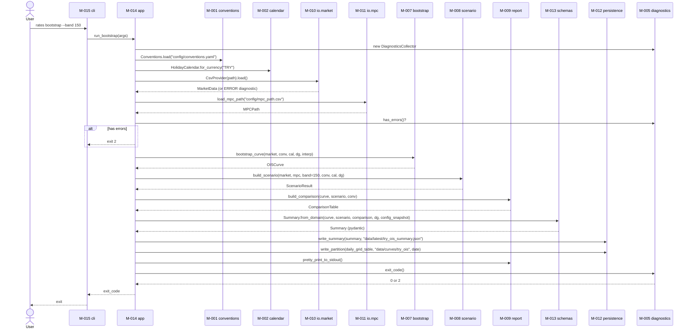
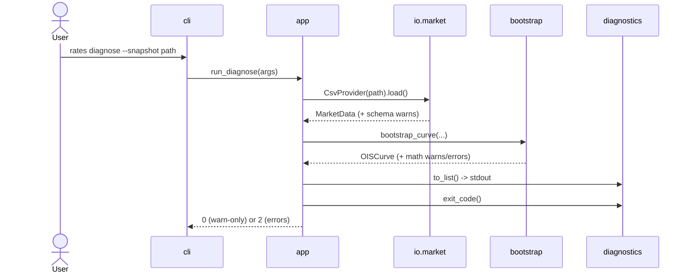
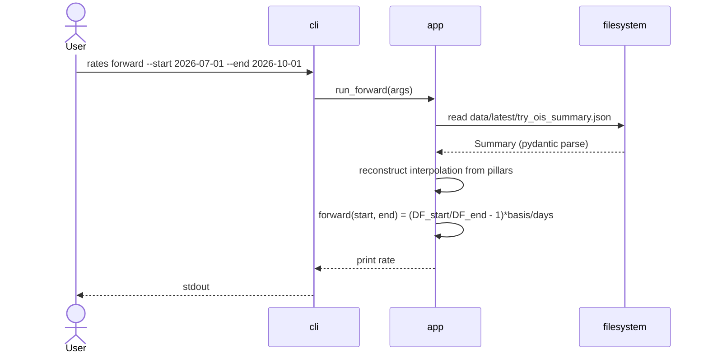

# Rates Engine — Architecture Document

**Based on:** `rates_engine_requirements.md` (Revision 2, Validated post-grill, 2026-04-17)
**Date:** 2026-05-06
**Status:** Validated (2026-05-06)
**Style:** Hexagonal layering (ports & adapters)

---

## 1. Architectural Drivers

| # | Driver | Detail | Architectural consequence |
|---|---|---|---|
| D1 | Change driver | Most volatile points: data source (CSV → V2 Bloomberg → ...), output consumer (CLI → V3 web UI), market conventions (V2 multi-currency). | Three points must sit behind Protocols/interfaces. Curve math (stable) is fully isolated from them. |
| D2 | Risk driver | Bootstrap correctness: 1e-10 reprice tolerance, byte-identical determinism, explicit replacement of known Excel defects. | Bootstrap module gets the highest test density and the most rigorous numerical method choice (closed-form + brentq). |
| D3 | Complexity driver | Quant math (bootstrap, interpolation, day-count round-trips, forward computation). Holiday/convention loaders are mid-complexity. CLI/IO/persistence are simple. | Allocate `opus` agent to bootstrap/curve/scenario; `sonnet` to IO; `haiku` to CLI/log/diagnostics. |
| D4 | Scale driver (low) | Single user, single machine, single currency (TRY) in V1. Hundreds of historical snapshots. | No distributed/cloud complexity. File-based persistence (Parquet partitioned dataset) sufficient. No SQLite needed. |
| D5 | Performance driver (soft) | <1s per run for 22 pillars + ~3700 daily grid points. Pragmatic, not hard. | numpy vectorization where it matters; profile hot paths only if needed. No premature optimization. |
| D6 | Extensibility driver | V2 BloombergProvider must plug in zero-touch. V3 web UI must consume Pydantic-generated JSON Schema. conventions.yaml extensible to USD/EUR. | `MarketDataProvider` Protocol; Pydantic v2 boundary models with `model_json_schema()` exported to `docs/schemas/`; per-currency config nesting. |
| D7 | Observability driver | WARN vs ERROR two-level severity, exit-code semantics (0 vs 2), all flags reach both stdout and JSON. | Single `DiagnosticsCollector` instance threaded through the pipeline; not module-level scattered. |

**Summary:** Hexagonal/ports-and-adapters. Pure deterministic core (math, no deps), surrounded by ports (Protocols), wrapped by adapters (CsvProvider, JsonWriter, ParquetWriter, CLI). Everything looks inward at the core; the core knows nothing about adapters.

---

## 2. Tech Stack

### Frozen (from requirements)

| Layer | Choice | Rationale | Alternative considered |
|---|---|---|---|
| Language | **Python 3.11** | Quant lingua franca; native numpy/pandas/scipy; mature type hints. | Rust/C++ (premature for V1). Python 3.12 (3.11 packages stable). |
| Numerics | **numpy** | Vectorize daily grid (~3700 points), DF/forward array math. | Pure Python (loop too slow), Polars (numpy/scipy bridge cost). |
| Tables | **pandas** | CSV ingest; `OISCurve` wraps a DataFrame; pyarrow Parquet round-trip. | Polars (smaller ecosystem for our deps), stdlib csv (insufficient). |
| Optimization | **scipy.optimize.brentq** | Bracket-based, gradient-free; guaranteed convergence on monotonic OIS root-finding; closed-form ≤1Y, brentq fallback >1Y irregular grids. | scipy.optimize.newton (can diverge), root_scalar (extra overhead). |
| Persistence | **pyarrow.dataset (Hive partitioning)** | Native partitioned dataset; `date=YYYY-MM-DD` write/read; pandas can also read. | pandas.to_parquet (no partition support), SQLite (wrong shape for time-series Parquet ecosystem). |
| Validation | **Pydantic v2** | IO-boundary CSV/JSON validation; auto JSON Schema export (V3 web UI contract); ~5–10× v1 perf. | Pydantic v1 (deprecated path), dataclass + manual validate (no JSON Schema), attrs (no built-in validation). |
| Internal models | **`@dataclass(frozen=True, slots=True)`** | Curve/Pillar/ScenarioResult; immutable, hashable, fast. | NamedTuple (weaker defaults+slots), pydantic everywhere (overkill internally). |
| Holidays | **`holidays` package + CSV override** | F-010 verbatim; fidelity check decides primary source. | CSV-only (yearly maintenance), workalendar (weaker TR coverage). |
| Config | **pyyaml** | conventions.yaml + holiday CSVs. | tomllib (3.11 stdlib but YAML example exists in requirements), json (not human-friendly). |
| CLI | **argparse (stdlib)** | "Stdlib, minimal ethos"; <30-line subcommands feasible. | typer (extra dep), click (overkill for V1). |
| Logging | **`rates.core.log.log()` indirection → print()** | V1 print, future loguru/structlog single-file swap. | logging stdlib (config burden V1 doesn't need). |
| Test | **pytest** | Standard; fixtures; parametrize. | unittest (verbose), Hypothesis (deferred per grill notes). |

### Approved additions

| Layer | Choice | Rationale |
|---|---|---|
| Type check | **mypy `--strict` on `rates.core.*` and `rates.io.*`** | Cheap regression net for numerical types; CLI/log layers excluded to keep it painless. |
| Lint/format | **ruff (lint + format)** | Single binary, replaces black + isort + flake8. Default config sufficient. |
| Pre-commit / CI | **Not in V1** | Solo dev; explicit non-goal in requirements. |

### Date handling decision

- **Public API:** `datetime.date` (immutable, JSON-friendly).
- **Internal vector ops:** `numpy.datetime64`.
- **Pandas `Timestamp`:** confined to DataFrame I/O boundary.

This aligns with the "DataFrame is implementation detail" principle.

---

## 3. Module Decomposition

### Module overview

| ID | Module | Responsibility | Complexity | Agent | Features |
|---|---|---|---|---|---|
| M-001 | `rates.core.conventions` | YAML loader → frozen `Conventions`; CLI override merge | low | sonnet | F-011 |
| M-002 | `rates.core.calendar` | Holiday calendar (pkg + CSV override); WORKDAY-equivalent API | low | sonnet | F-010 |
| M-003 | `rates.core.daycount` | Pure day-count fraction functions (Act/360, Act/365, …) | low | sonnet | F-011 |
| M-004 | `rates.core.log` | `log(level, msg)` indirection; V1 print, future swap | low | haiku | NFR monitoring |
| M-005 | `rates.core.diagnostics` | `DiagnosticsCollector` (WARN/ERROR records, exit-code mapping) | low | haiku | F-006 |
| M-016 | `rates.core.types` | Frozen input domain dataclasses: `MarketData`, `MarketQuote`, `MPCPath`, `MPCMeeting` | low | sonnet | F-004, F-007 |
| M-006 | `rates.core.curve` | `OISCurve` domain object; DF/forward/zero accessors; two interpolation schemes; `forward_ladder` | medium | opus | F-002, F-003 |
| M-007 | `rates.core.bootstrap` | Unified OIS bootstrap (closed-form + brentq fallback); deterministic; 1e-10 reprice | **high** | opus | F-001 |
| M-008 | `rates.core.scenario` | MPC path → daily TLREF index (Act/365); ±N bps full-path parallel band | medium | opus | F-004, F-005 |
| M-009 | `rates.core.report` | Market-vs-scenario comparison (Act/365 common basis); pretty stdout | low | sonnet | F-012 |
| M-010 | `rates.io.market` | `MarketDataProvider` Protocol + `CsvProvider` impl | medium | sonnet | F-007 |
| M-011 | `rates.io.mpc` | MPC CSV reader → frozen `MPCPath` | low | sonnet | F-004 (input) |
| M-012 | `rates.io.persistence` | Summary JSON writer + PyArrow partitioned dataset writer | medium | sonnet | F-008 |
| M-013 | `rates.io.schemas` | Pydantic v2 output models + JSON Schema export | medium | sonnet | F-008, V3 UI |
| M-014 | `rates.app` | Pipeline orchestrator: providers → bootstrap → scenario → report → persistence | medium | sonnet | F-009 (logic) |
| M-015 | `rates.cli` | argparse subcommands (`bootstrap`, `diagnose`, `forward`); each <30 LoC | low | haiku | F-009 |

**Total: 16 modules.**

### Layering & dependency direction

```
                      ┌─────────────────────────┐
                      │ M-015  rates.cli        │
                      └────────────┬────────────┘
                                   ▼
                      ┌─────────────────────────┐
                      │ M-014  rates.app        │
                      └────┬───────────────┬────┘
                           │               │
              ┌────────────┘               └──────────────┐
              ▼                                            ▼
    ┌─────────────────────┐  ◄── Protocol ──    ┌──────────────────────┐
    │  rates.core.*        │                     │  rates.io.*           │
    │  (M-006..M-009)      │                     │  (M-010..M-013)       │
    └──────────┬──────────┘                     └──────────────────────┘
               │
               ▼
    ┌─────────────────────────────────────────────────────┐
    │  Foundation: M-001..M-005, M-016                     │
    │  conventions, calendar, daycount, log, diagnostics,  │
    │  types                                                │
    └─────────────────────────────────────────────────────┘
```

**No cycles.** `core` never imports `io`. `io` implements the Protocol declared in `core` (or returns `core.types` instances). `app` knows both. `cli` knows only `app`.

### Module details

```json
{
  "modules": [
    {
      "module_id": "M-001",
      "name": "rates.core.conventions",
      "responsibility": "Load config/conventions.yaml; produce frozen Conventions object; merge CLI overrides.",
      "owns_data": ["Conventions", "CurrencyConvention", "PaymentConvention", "TLREFConvention", "SpreadReportingConvention"],
      "depends_on": [],
      "external_deps": ["pyyaml"],
      "features_served": ["F-011"],
      "complexity": "low",
      "suggested_agent": "sonnet",
      "notes": "Conventions chosen so that rate -> DF -> rate round-trip is 1e-12 accurate. No global state — explicitly threaded."
    },
    {
      "module_id": "M-002",
      "name": "rates.core.calendar",
      "responsibility": "Build HolidayCalendar from holidays package + CSV overrides; expose is_holiday, is_business_day, add_business_days.",
      "owns_data": ["HolidayCalendar"],
      "depends_on": [],
      "external_deps": ["holidays"],
      "features_served": ["F-010"],
      "complexity": "low",
      "suggested_agent": "sonnet",
      "notes": "CSV overrides win over package on conflict. One-time fidelity script lives in scripts/ (out of module)."
    },
    {
      "module_id": "M-003",
      "name": "rates.core.daycount",
      "responsibility": "Pure day-count fraction functions. Single signature: year_fraction(d1, d2, basis) -> float.",
      "owns_data": [],
      "depends_on": [],
      "external_deps": [],
      "features_served": ["F-011 (NFR)"],
      "complexity": "low",
      "suggested_agent": "sonnet",
      "notes": "360/365 magic numbers appear ONLY here as literals. Everywhere else uses Conventions.day_count."
    },
    {
      "module_id": "M-004",
      "name": "rates.core.log",
      "responsibility": "log(level, msg, **ctx) indirection; V1 print, V2 structlog/loguru single-file swap.",
      "owns_data": [],
      "depends_on": [],
      "external_deps": [],
      "features_served": [],
      "complexity": "low",
      "suggested_agent": "haiku",
      "notes": "Library code calls log() not print()."
    },
    {
      "module_id": "M-005",
      "name": "rates.core.diagnostics",
      "responsibility": "DiagnosticsCollector. Records {severity, code, message, context} entries. Computes exit code (any-ERROR -> 2, else 0).",
      "owns_data": ["Diagnostic", "Severity (enum)", "DiagnosticsCollector"],
      "depends_on": ["M-004"],
      "external_deps": [],
      "features_served": ["F-006"],
      "complexity": "low",
      "suggested_agent": "haiku",
      "notes": "Single instance threaded explicitly through pipeline. Modules call warn()/error() only; abort decision sits with rates.app."
    },
    {
      "module_id": "M-016",
      "name": "rates.core.types",
      "responsibility": "Frozen dataclasses for input domain objects: MarketData, MarketQuote, MPCPath, MPCMeeting.",
      "owns_data": ["MarketData", "MarketQuote", "MPCPath", "MPCMeeting"],
      "depends_on": [],
      "external_deps": [],
      "features_served": ["F-004 (input)", "F-007 (input)"],
      "complexity": "low",
      "suggested_agent": "sonnet",
      "notes": "Lives in core to avoid core->io import. io.market and io.mpc return instances of these types. MarketData has a special_rates: dict[str, float] populated from rows like BISTTREF."
    },
    {
      "module_id": "M-006",
      "name": "rates.core.curve",
      "responsibility": "OISCurve domain object: pillar table (DataFrame internal) + numpy daily grid. Public API: df_at, zero_at, forward, forward_ladder, pillars (defensive copy), to_summary_dict.",
      "owns_data": ["OISCurve", "Pillar", "ForwardLadderEntry"],
      "depends_on": ["M-001", "M-003"],
      "external_deps": ["numpy", "pandas"],
      "features_served": ["F-002", "F-003"],
      "complexity": "medium",
      "suggested_agent": "opus",
      "notes": "DataFrame is implementation detail; never exposed. Calendar-day weight w=(t-a)/(b-a). At pillar dates, interpolation returns the bootstrapped DF exactly (test invariant)."
    },
    {
      "module_id": "M-007",
      "name": "rates.core.bootstrap",
      "responsibility": "Unified OIS swap bootstrap. <=1Y: bullet, closed-form. >1Y: annual coupon, closed-form when possible (e.g. 2Y given known 1Y DF), scipy.optimize.brentq fallback for irregular grids. Deterministic. Direct quote wins over implied.",
      "owns_data": ["BootstrapResult"],
      "depends_on": ["M-001", "M-002", "M-003", "M-005", "M-006", "M-016"],
      "external_deps": ["numpy", "scipy.optimize.brentq"],
      "features_served": ["F-001"],
      "complexity": "high",
      "suggested_agent": "opus",
      "notes": "Highest test density. No randomness anywhere. Tenor collisions emit a WARN diagnostic with implied-vs-direct spread."
    },
    {
      "module_id": "M-008",
      "name": "rates.core.scenario",
      "responsibility": "Build daily TLREF index from MPCPath + initial TLREF (Act/365). Implement scenario band: ±N bps full-path parallel shift; band=0 short-circuits to mid only.",
      "owns_data": ["ScenarioResult", "DailyIndex"],
      "depends_on": ["M-001", "M-002", "M-003", "M-005", "M-016"],
      "external_deps": ["numpy"],
      "features_served": ["F-004", "F-005"],
      "complexity": "medium",
      "suggested_agent": "opus",
      "notes": "Initial TLREF read from MarketData.special_rates['BISTTREF']; missing => ERROR. Index on day 1 = 1.0."
    },
    {
      "module_id": "M-009",
      "name": "rates.core.report",
      "responsibility": "Market-vs-scenario tenor-by-tenor comparison in common Act/365 (TLREF) basis. Covers pillar tenors + monthly forward ladder. Pretty stdout (--quiet to suppress).",
      "owns_data": ["ComparisonTable", "ComparisonRow"],
      "depends_on": ["M-001", "M-003", "M-006"],
      "external_deps": [],
      "features_served": ["F-012"],
      "complexity": "low",
      "suggested_agent": "sonnet",
      "notes": "Market rate native Act/360 -> Act/365 via DF: r_365 = (1/DF - 1) * 365 / days."
    },
    {
      "module_id": "M-010",
      "name": "rates.io.market",
      "responsibility": "Define MarketDataProvider Protocol (methods: load(valuation_date) -> MarketData). Implement CsvProvider for snapshot CSVs.",
      "owns_data": ["MarketDataProvider (Protocol)", "CsvProvider"],
      "depends_on": ["M-005", "M-016"],
      "external_deps": ["pandas", "pydantic"],
      "features_served": ["F-007"],
      "complexity": "medium",
      "suggested_agent": "sonnet",
      "notes": "Forgiving reader: ignores extra columns, accepts optional '# schema: v1' first-line comment. Required column missing => ERROR. V2 BloombergProvider implements same Protocol."
    },
    {
      "module_id": "M-011",
      "name": "rates.io.mpc",
      "responsibility": "Read config/mpc_path.csv into frozen MPCPath (meeting_date, bps_change, optional rationale).",
      "owns_data": [],
      "depends_on": ["M-005", "M-016"],
      "external_deps": ["pandas", "pydantic"],
      "features_served": ["F-004 (input side)"],
      "complexity": "low",
      "suggested_agent": "sonnet",
      "notes": "Pydantic validation at boundary; produces M-016 frozen dataclass internally."
    },
    {
      "module_id": "M-012",
      "name": "rates.io.persistence",
      "responsibility": "Write summary JSON (data/latest/try_ois_summary.json, pretty, indent=2). Write PyArrow partitioned dataset (data/curves/try_ois/date=YYYY-MM-DD/) using hive partitioning. Re-run = overwrite.",
      "owns_data": [],
      "depends_on": ["M-013"],
      "external_deps": ["pyarrow", "pyarrow.dataset"],
      "features_served": ["F-008"],
      "complexity": "medium",
      "suggested_agent": "sonnet",
      "notes": "schema_version embedded in both outputs. V1 schema_version = 1."
    },
    {
      "module_id": "M-013",
      "name": "rates.io.schemas",
      "responsibility": "Pydantic v2 output models: Summary, Pillar, ForwardRow, ComparisonRow, Diagnostic, ConfigSnapshot. Provide Summary.from_domain(...) builder and a script entry to export model_json_schema() to docs/schemas/summary.schema.json.",
      "owns_data": ["Summary", "Pillar (output)", "ForwardRow", "ComparisonRow", "Diagnostic (output)", "ConfigSnapshot"],
      "depends_on": ["M-016"],
      "external_deps": ["pydantic"],
      "features_served": ["F-008", "V3 web UI contract"],
      "complexity": "medium",
      "suggested_agent": "sonnet",
      "notes": "Domain dataclass -> pydantic mapper centralized here. schema_version mandatory."
    },
    {
      "module_id": "M-014",
      "name": "rates.app",
      "responsibility": "Pipeline orchestrator. Functions: run_bootstrap(args), run_diagnose(args), run_forward(args). Each returns int exit code. Keeps CLI subcommands <30 LoC.",
      "owns_data": ["PipelineResult"],
      "depends_on": ["M-001", "M-002", "M-005", "M-006", "M-007", "M-008", "M-009", "M-010", "M-011", "M-012", "M-013"],
      "external_deps": [],
      "features_served": ["F-009 (logic)"],
      "complexity": "medium",
      "suggested_agent": "sonnet",
      "notes": "Construction order matters: Conventions -> Calendar -> Diagnostics -> Providers -> Bootstrap -> Scenario -> Report -> Persistence."
    },
    {
      "module_id": "M-015",
      "name": "rates.cli",
      "responsibility": "argparse-based 'rates' entry point: subcommands bootstrap, diagnose, forward. Each <30 LoC: arg parsing + delegation to rates.app.",
      "owns_data": [],
      "depends_on": ["M-014"],
      "external_deps": ["argparse"],
      "features_served": ["F-009"],
      "complexity": "low",
      "suggested_agent": "haiku",
      "notes": "pyproject.toml entry point: rates = 'rates.cli:main'."
    }
  ]
}
```

---

## 4. Interface Contracts

```json
{
  "contracts": [
    {
      "contract_id": "C-001",
      "name": "MarketDataProvider Protocol",
      "from": "M-014 rates.app",
      "to": "M-010 rates.io.market",
      "type": "function_call",
      "interface": {
        "protocol": "MarketDataProvider",
        "methods": [
          {
            "name": "load",
            "input": {"valuation_date": "datetime.date | None"},
            "output": "MarketData (frozen dataclass)"
          }
        ],
        "error_cases": ["FileNotFoundError", "SchemaValidationError", "EmptyDataError", "BISTTREFMissingError"]
      },
      "notes": "V2 BloombergProvider implements same Protocol; rates.app code unchanged."
    },
    {
      "contract_id": "C-002",
      "name": "bootstrap_curve",
      "from": "M-014 rates.app",
      "to": "M-007 rates.core.bootstrap",
      "type": "function_call",
      "interface": {
        "name": "bootstrap_curve",
        "input": {
          "market": "MarketData",
          "conventions": "Conventions",
          "calendar": "HolidayCalendar",
          "diagnostics": "DiagnosticsCollector",
          "interp": "Literal['log_linear_df', 'linear_zero'] = 'log_linear_df'"
        },
        "output": "OISCurve",
        "error_cases": ["BootstrapNonConvergent (escalated to ERROR diagnostic)", "ZeroValidQuotesError"]
      },
      "invariants": [
        "Deterministic: identical input -> byte-identical output.",
        "Each pillar reprices to within 1e-10 absolute error.",
        "Interpolation at pillar date returns exact bootstrapped DF."
      ]
    },
    {
      "contract_id": "C-003",
      "name": "build_scenario",
      "from": "M-014 rates.app",
      "to": "M-008 rates.core.scenario",
      "type": "function_call",
      "interface": {
        "name": "build_scenario",
        "input": {
          "market": "MarketData",
          "mpc_path": "MPCPath",
          "band_bps": "int (>=0; 0=mid only)",
          "horizon_days": "int (default ~10y business days)",
          "conventions": "Conventions",
          "calendar": "HolidayCalendar",
          "diagnostics": "DiagnosticsCollector"
        },
        "output": "ScenarioResult",
        "error_cases": ["MissingInitialTLREF (ERROR)", "InvalidMPCSchedule (ERROR)"]
      },
      "invariants": [
        "Index on day 1 (valuation date) = 1.0 in mid/low/high.",
        "band_bps=0 -> low/high are None (short-circuit).",
        "Index_N = product over t<=N of (1 + rate_t / 365 * delta_t)."
      ]
    },
    {
      "contract_id": "C-004",
      "name": "DiagnosticsCollector",
      "from": "any module (M-006..M-013)",
      "to": "M-005 rates.core.diagnostics",
      "type": "function_call",
      "interface": {
        "class": "DiagnosticsCollector",
        "methods": [
          {"name": "warn", "input": {"code": "str", "message": "str", "context": "dict"}, "output": "None"},
          {"name": "error", "input": {"code": "str", "message": "str", "context": "dict"}, "output": "None"},
          {"name": "to_list", "output": "list[Diagnostic]"},
          {"name": "exit_code", "output": "int (2 if any error else 0)"},
          {"name": "has_errors", "output": "bool"}
        ]
      },
      "notes": "Single instance threaded explicitly. Modules don't decide abort/continue — rates.app does."
    },
    {
      "contract_id": "C-005",
      "name": "OISCurve public API",
      "from": "M-009, M-013, M-014",
      "to": "M-006 rates.core.curve",
      "type": "function_call",
      "interface": {
        "class": "OISCurve",
        "methods": [
          {"name": "df_at", "input": {"date": "datetime.date"}, "output": "float"},
          {"name": "zero_at", "input": {"date": "datetime.date", "basis": "DayCount"}, "output": "float"},
          {"name": "forward", "input": {"start": "datetime.date", "end": "datetime.date"}, "output": "float"},
          {"name": "forward_ladder", "output": "DataFrame (1x2,2x3,...,11x12,1x3,3x6,6x9,9x12)"},
          {"name": "pillars", "output": "DataFrame (defensive copy)"},
          {"name": "to_summary_dict", "output": "dict (JSON-serializable)"}
        ],
        "error_cases": ["DateOutOfRange"]
      },
      "notes": "Internal DataFrame never leaks; defensive copy on pillars()."
    },
    {
      "contract_id": "C-006",
      "name": "Summary persistence",
      "from": "M-014 rates.app",
      "to": "M-012 rates.io.persistence",
      "type": "function_call",
      "interface": {
        "functions": [
          {"name": "write_summary", "input": {"summary": "Summary", "path": "Path"}, "output": "None"},
          {"name": "write_partition", "input": {"daily_grid": "pyarrow.Table", "root": "Path", "valuation_date": "date"}, "output": "None"}
        ],
        "error_cases": ["IOError"]
      },
      "invariants": [
        "Summary JSON pretty-printed (indent=2).",
        "Re-run on same day overwrites partition directory entirely.",
        "schema_version embedded in both outputs."
      ]
    },
    {
      "contract_id": "C-007",
      "name": "load_mpc_path",
      "from": "M-014 rates.app",
      "to": "M-011 rates.io.mpc",
      "type": "function_call",
      "interface": {"name": "load_mpc_path", "input": {"path": "Path"}, "output": "MPCPath", "error_cases": ["FileNotFoundError", "SchemaValidationError"]}
    },
    {
      "contract_id": "C-008",
      "name": "Conventions.load",
      "from": "M-014 rates.app",
      "to": "M-001 rates.core.conventions",
      "type": "function_call",
      "interface": {"name": "Conventions.load", "input": {"yaml_path": "Path", "overrides": "dict[str, Any]"}, "output": "Conventions"}
    },
    {
      "contract_id": "C-009",
      "name": "HolidayCalendar API",
      "from": "M-006, M-007, M-008, M-014",
      "to": "M-002 rates.core.calendar",
      "type": "function_call",
      "interface": {
        "class": "HolidayCalendar",
        "methods": [
          {"name": "for_currency", "input": {"ccy": "str"}, "output": "HolidayCalendar"},
          {"name": "is_business_day", "input": {"d": "date"}, "output": "bool"},
          {"name": "add_business_days", "input": {"d": "date", "n": "int"}, "output": "date"}
        ]
      }
    },
    {
      "contract_id": "C-010",
      "name": "year_fraction",
      "from": "M-006, M-007, M-008, M-009",
      "to": "M-003 rates.core.daycount",
      "type": "function_call",
      "interface": {"name": "year_fraction", "input": {"d1": "date", "d2": "date", "basis": "DayCount"}, "output": "float"}
    },
    {
      "contract_id": "C-011",
      "name": "build_comparison",
      "from": "M-014 rates.app",
      "to": "M-009 rates.core.report",
      "type": "function_call",
      "interface": {"name": "build_comparison", "input": {"curve": "OISCurve", "scenario": "ScenarioResult", "conventions": "Conventions"}, "output": "ComparisonTable"}
    },
    {
      "contract_id": "C-012",
      "name": "Summary.from_domain",
      "from": "M-014 rates.app",
      "to": "M-013 rates.io.schemas",
      "type": "function_call",
      "interface": {"name": "Summary.from_domain", "input": {"curve": "OISCurve", "scenario": "ScenarioResult", "comparison": "ComparisonTable", "config_snapshot": "dict", "diagnostics": "list[Diagnostic]"}, "output": "Summary (pydantic)"}
    },
    {
      "contract_id": "C-013",
      "name": "CLI -> App",
      "from": "M-015 rates.cli",
      "to": "M-014 rates.app",
      "type": "function_call",
      "interface": {
        "functions": [
          {"name": "run_bootstrap", "input": {"args": "argparse.Namespace"}, "output": "int (exit code)"},
          {"name": "run_diagnose", "input": {"args": "argparse.Namespace"}, "output": "int"},
          {"name": "run_forward", "input": {"args": "argparse.Namespace"}, "output": "int"}
        ]
      }
    },
    {
      "contract_id": "C-014",
      "name": "log indirection",
      "from": "any module",
      "to": "M-004 rates.core.log",
      "type": "function_call",
      "interface": {"name": "log", "input": {"level": "str", "msg": "str", "ctx": "dict"}, "output": "None"}
    }
  ]
}
```

### Contract rules applied

- **Consumer-owned:** every contract phrased from the consumer's needs; provider implements.
- **Error cases mandatory:** each contract lists what happens on failure.
- **Simplest comm type:** all contracts are in-process function calls. No HTTP/queue/event introduced — single-process Python CLI doesn't need them.
- **Fully typed:** no `Any` except `dict[str, Any]` in CLI override merge (intentional — config keys are dynamic).

---

## 5. Data Flow

```mermaid
graph LR
    A[snapshot_YYYYMMDD.csv]:::input --> B[io.market<br/>CsvProvider]
    C[mpc_path.csv]:::input --> D[io.mpc]
    E[conventions.yaml]:::input --> F[core.conventions]
    G[holidays/&#42;.csv + holidays pkg]:::input --> H[core.calendar]

    B --> I[MarketData]:::dom
    D --> J[MPCPath]:::dom
    F --> K[Conventions]:::dom
    H --> L[HolidayCalendar]:::dom

    I --> M[core.bootstrap]:::core
    K --> M
    L --> M
    M --> N[OISCurve]:::dom

    I --> O[core.scenario]:::core
    J --> O
    K --> O
    L --> O
    O --> P[ScenarioResult]:::dom

    N --> Q[core.report]:::core
    P --> Q
    K --> Q
    Q --> R[ComparisonTable]:::dom

    N --> S[io.schemas<br/>Summary.from_domain]:::core
    P --> S
    R --> S
    DG[DiagnosticsCollector]:::dom --> S
    S --> T[io.persistence]:::core

    T --> U[data/latest/try_ois_summary.json]:::output
    T --> V[data/curves/try_ois/date=&#42;/&#42;.parquet]:::output
    T --> W[stdout pretty table]:::output

    classDef input fill:#fef3c7,stroke:#92400e
    classDef output fill:#d1fae5,stroke:#065f46
    classDef dom fill:#dbeafe,stroke:#1e40af
    classDef core fill:#f3e8ff,stroke:#6b21a8
```



---

## 6. Key Sequences

### `rates bootstrap --band 150` (primary user flow)



### `rates diagnose` (no outputs)



### `rates forward --start --end` (ad-hoc query)



---

## 7. Build Order

```json
{
  "build_phases": [
    {
      "phase": 1,
      "name": "Foundation",
      "modules": ["M-001 conventions", "M-002 calendar", "M-003 daycount", "M-004 log", "M-005 diagnostics", "M-016 core.types"],
      "rationale": "No business logic; just config, util, input domain dataclasses. All <100 LoC. Phases 2-5 all depend on these.",
      "deliverable": "Conventions.load() reads YAML; HolidayCalendar.for_currency('TR') returns WORKDAY-equivalent; year_fraction round-trip 1e-12; DiagnosticsCollector tests green; MarketData/MPCPath dataclasses constructible.",
      "estimated_effort": "small",
      "exit_criteria": "tests/foundation/ green; mypy --strict clean."
    },
    {
      "phase": 2,
      "name": "Curve & Bootstrap (highest risk)",
      "modules": ["M-006 curve", "M-007 bootstrap"],
      "rationale": "Heart of the system. Most numerical testing required. Risk-early: tackle the hardest piece while context is fresh and 1e-10 reprice acceptance criterion can be validated against hand-crafted MarketData fixtures.",
      "deliverable": "Hand-crafted MarketData -> bootstrap_curve -> 22 pillars within 1e-10 abs reprice; both interpolation schemes exact at pillar dates; forward_ladder() populated; deterministic byte-identical output across runs.",
      "estimated_effort": "large",
      "exit_criteria": "tests/curve/ + tests/bootstrap/ green; golden-number fixtures committed."
    },
    {
      "phase": 3,
      "name": "Scenario & Report",
      "modules": ["M-008 scenario", "M-009 report"],
      "rationale": "After bootstrap stabilizes, build scenario index and comparison table. Tests cover band=0 short-circuit and parallel-shift symmetry.",
      "deliverable": "Hand-crafted MarketData + MPCPath -> ScenarioResult (mid + ±band); curve+scenario -> ComparisonTable (Act/365 spread bps); pretty stdout.",
      "estimated_effort": "medium",
      "exit_criteria": "tests/scenario/ + tests/report/ green; band=0 vs band=150 edge cases covered."
    },
    {
      "phase": 4,
      "name": "IO & Schemas",
      "modules": ["M-010 io.market", "M-011 io.mpc", "M-013 io.schemas", "M-012 io.persistence"],
      "rationale": "Pure math layer done; now real data flows in/out. Schemas before persistence (dependency).",
      "deliverable": "Real snapshot CSV -> MarketData; mpc CSV -> MPCPath; Summary JSON Schema exported (docs/schemas/summary.schema.json); summary.json + parquet partition written to disk.",
      "estimated_effort": "medium",
      "exit_criteria": "tests/io/ green; JSON write/read round-trip; Parquet partition re-readable via pyarrow.dataset and pandas.read_parquet."
    },
    {
      "phase": 5,
      "name": "App orchestrator & CLI",
      "modules": ["M-014 app", "M-015 cli"],
      "rationale": "All pieces ready; just pipeline composition + argparse glue. Each CLI subcommand <30 LoC validated here.",
      "deliverable": "rates bootstrap / diagnose / forward subcommands work end-to-end; integration test from real snapshot CSV to output files.",
      "estimated_effort": "small",
      "exit_criteria": "tests/integration/test_e2e_bootstrap.py green; CLI subcommand line counts <30."
    }
  ]
}
```

### Ordering principles applied

1. **Dependencies first** — foundation → math → IO → orchestration.
2. **Risk early** — bootstrap (highest complexity, most numerical risk) in phase 2, not last.
3. **Value early** — phase 2 already produces a useful library (hand-crafted fixtures suffice); IO is later UX layer.
4. **Stub strategy** — phases 2-3 use hand-crafted MarketData; real `io.market` deferred to phase 4. This is exactly why interface contracts matter.

---

## 8. Decisions & Trade-offs

| # | Decision | What was chosen | What was rejected | Why |
|---|---|---|---|---|
| A1 | Architectural style | Hexagonal / ports & adapters | Layered (controller → service → repo); pure functional | Drivers D1 (change isolation) and D6 (V2/V3 extensibility) demand a clean Protocol seam. Layered is too coupled; functional adds learning cost without payoff for solo dev. |
| A2 | Module count | 16 | 5–6 chunky modules | Each module <200 LoC matches the simplicity guideline; allows multi-model assignment per CLAUDE.md (opus on math, sonnet on IO, haiku on glue). Chunky modules force one-size-fits-all model use. |
| A3 | Domain types location | `rates.core.types` (M-016) holds MarketData/MPCPath dataclasses | Define in `rates.io.market` next to the Provider | Defining inputs in core preserves the no-cycles rule (core never imports io). Cost: one extra module of trivial size. |
| A4 | Pydantic scope | Only at IO boundary (M-010, M-011 input; M-013 output) | Pydantic everywhere | Internal dataclasses are faster, immutable by default, and don't carry validation cost on hot paths. Implementation hint in requirements explicitly recommends this split. |
| A5 | Diagnostics threading | Single explicit collector instance passed to each function | Module-level singleton; logging-style global | Drivers: testability (collector mockable per test), observability (single source of truth for stdout+JSON unification), no global state per implementation hint. Cost: extra parameter on every public function. |
| A6 | Persistence schema versioning | Field `schema_version` in both Summary and Parquet schema; no migrator in V1 | Pickle/marshmallow; just no version | Cheap forward-compat hook (1 LoC field) reserves the option to write a read-time migrator in V2 without breaking V1 consumers. |
| A7 | CLI framework | argparse | typer, click | Requirements explicitly mandate "stdlib, minimal ethos". argparse is sufficient given <30 LoC subcommands. |
| A8 | Interpolation distance metric | Calendar days | Business days; year fraction | Grill decision G7 (requirements §9). Calendar-day weight is the simpler, market-standard choice. |
| A9 | Date type | `datetime.date` for public API; `numpy.datetime64` internal; `pandas.Timestamp` only at DataFrame boundary | All `pandas.Timestamp` end-to-end | `datetime.date` is JSON-friendly, immutable, and decouples public API from pandas. Internal vector ops still get numpy speed. |
| A10 | Holiday strategy validation | Build-time fidelity check script under `scripts/`, not a module | Module under `rates.core.calendar` | Per F-010 acceptance criteria: one-off validation, not a runtime concern. Keeps M-002 small. |
| A11 | Pipeline orchestration location | Dedicated `rates.app` module (M-014) | CLI directly composes core+io | F-009 acceptance criterion mandates <30 LoC per CLI subcommand. Direct composition would explode CLI size. |
| A12 | Test framework | pytest only (no Hypothesis) | pytest + Hypothesis | Per requirements §9 grill notes: Hypothesis explicitly deferred (revisit at V1 sign-off). |
| A13 | Scenario band semantic | Full path parallel shift, band=0 short-circuit | Per-meeting independent shift; product of constant-shift compounding | Grill decisions G1, G2 (requirements §9). |
| A14 | Bootstrap algorithm | Unified OIS swap formula, all pillars; closed-form ≤1Y; closed-form 2Y; brentq irregular grids | Excel chained AD column reproduction | Grill decision G3, G10. Excel's chained convention is non-standard and contains the buggy cumulative DF artifact. |

---

## 9. Open Architecture Questions

| # | Question | Why it's open | Suggested resolution path |
|---|---|---|---|
| O1 | Pillar tarihlerinin tatil günlerine düşmesi durumunda payment shift kuralı (modified following / following / preceding)? | Conventions YAML'da yer yok henüz; OIS pillar maturity hesaplari tatile düştüğünde davranış belirsiz. | Phase 1'de M-001 conventions schema'sina `business_day_convention: "modified_following"` (default) ekle; Phase 2 bootstrap'ta bu kullan. Test: tatil hafta sonuna komşu pillar. |
| O2 | Forward ladder canonical set: requirements'taki liste (1x2,...,11x12,1x3,3x6,6x9,9x12) yeterli mi yoksa year-cross (12x24, 24x36) eklenmeli mi? | F-003 acceptance bu listeyi sabitliyor ama F-012 "monthly forward ladder points" diyor; year-over-year forward'lar deferred mi? | Suggested: V1 = requirements'taki 16-entry liste. Year-cross V2'ye ertele. Phase 2 sonu validate et. |
| O3 | `ScenarioResult` daily index granularitesi: business days only mi, calendar days mi? | F-004 "business days" diyor (3723), F-005 ise gunluk akkumlasyon. Tatil gunleri index'te yok mu yoksa carry-forward mi? | Onerim: business-day only index (TLREF native granularitesi); tatilleri TLREF konventasyonel olarak son business day'in degerini tasiyor. Phase 3 baslarken karara bagla. |
| O4 | Parquet daily-grid satir semasi: bir satir = bir gun mu, bir satir = (gun, scenario_label)?| F-008'de Hive partitioning (date=...) zaten partitioning'i belirliyor; ama satir icinde scenario boyutu var. | Onerim: long-format (gun x scenario_label uzun tablo). Web UI/backtest icin daha esnek. Phase 4'te sema kararla, schema_version=1 ile dondur. |
| O5 | `rates forward` subcommand'inin curve reconstruction'u: pillarlardan re-interpolate mi, yoksa Parquet daily grid'inden direkt okumak mi? | F-009 acceptance "reads latest summary JSON" diyor. Summary JSON'da pillar liste var, daily grid yok; reconstruction interpolation yapmali. | Phase 5 implementation note: Summary -> pillarlardan OISCurve.from_pillars() rebuild. Tek-fonksiyon yardimci, M-006'ya ekle. |
| O6 | mypy `--strict` Pydantic v2 ile uyumu (plugin gerekli mi)? | pydantic v2 mypy plugin acigi olabilir; Conventions/Summary modellerinde generic alanlar varsa | Phase 1'de denenir; gerekirse `pydantic.mypy` plugin'i requirements-dev.txt'e eklenir. Maliyet: 1 satir config. |

---

## 10. Project Layout (informational)

V1 dizin yapisi (Phase 1 baslangici):

```
rates_engine/
├── pyproject.toml
├── requirements.txt
├── requirements-dev.txt
├── README.md
├── CLAUDE.md
├── docs/
│   ├── architecture.md           ← bu dokuman
│   ├── holidays-fidelity.md      ← phase 1 sonu
│   └── schemas/
│       └── summary.schema.json   ← phase 4 sonu (auto-export)
├── config/
│   ├── conventions.yaml
│   ├── mpc_path.csv
│   └── holidays/
│       ├── tr.csv
│       ├── us.csv
│       └── eu.csv
├── data/
│   ├── snapshots/
│   │   └── snapshot_YYYYMMDD.csv
│   ├── latest/
│   │   └── try_ois_summary.json
│   └── curves/
│       └── try_ois/
│           └── date=YYYY-MM-DD/
├── scripts/
│   └── check_holidays_fidelity.py
├── src/
│   └── rates/
│       ├── __init__.py
│       ├── core/
│       │   ├── __init__.py
│       │   ├── conventions.py
│       │   ├── calendar.py
│       │   ├── daycount.py
│       │   ├── log.py
│       │   ├── diagnostics.py
│       │   ├── types.py
│       │   ├── curve.py
│       │   ├── bootstrap.py
│       │   ├── scenario.py
│       │   └── report.py
│       ├── io/
│       │   ├── __init__.py
│       │   ├── market.py
│       │   ├── mpc.py
│       │   ├── schemas.py
│       │   └── persistence.py
│       ├── app.py
│       └── cli.py
└── tests/
    ├── foundation/
    ├── curve/
    ├── bootstrap/
    ├── scenario/
    ├── report/
    ├── io/
    └── integration/
```
