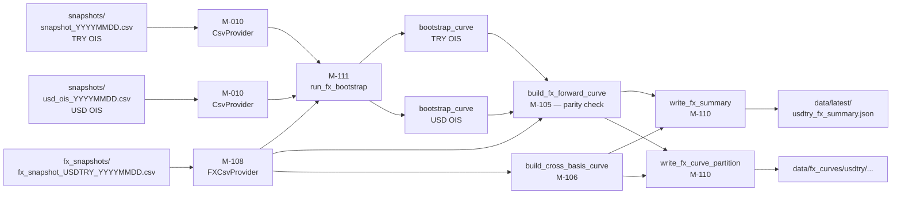
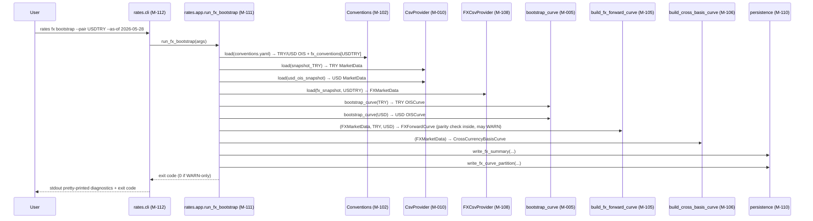
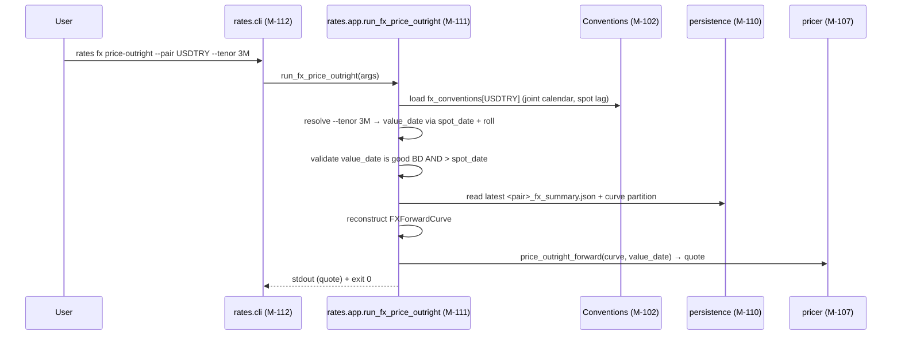

# rates_engine v0.3.0 — FX IO / CLI / App Architecture

**Based on:** `docs/architecture.md` (V1 OIS), `docs/fx-architecture.md` (V2 FX math layer), `CHANGELOG.md` v0.2.0 "Not in this release" section.
**Date:** 2026-05-28
**Status:** Post-Grill Review — Awaiting Final Human Validation (PR #15) — 2026-05-28 (grill rounds 1–4 applied; 8/8 focus areas resolved)
**Ticket:** MON-013
**Scope:** wire the v0.2.0 FX math layer (M-101..M-107) into IO, CLI, and pipeline orchestration so it is consumable end-to-end. No changes to FX math; no V3 xccy stripping.

---

## 1. Architectural Drivers

| Driver | Detail |
|--------|--------|
| **Change driver** | FX snapshot input format. Hidden behind an `FXMarketDataProvider` `Protocol` so a future Bloomberg / Refinitiv adapter implements the same seam (mirrors V1 `MarketDataProvider`). |
| **Risk driver** | Dual-OIS orchestration. The covered-interest-parity check inside `build_fx_forward_curve` (M-105) needs both the domestic (TRY) and foreign (USD/EUR) OIS curves bootstrapped from independent snapshots. One `rates fx bootstrap` invocation reads three CSVs and runs OIS bootstrap twice before the FX layer ever runs. |
| **Compatibility driver** | V1 OIS CLI surface (`rates bootstrap`, `rates diagnose`, `rates forward`) MUST NOT break. New FX verbs are added as a nested `rates fx <verb>` subparser. |
| **Reuse driver** | `conventions.yaml` already carries USD/EUR OIS rows (added in v0.2.0) and `fx_conventions` per pair. The existing `CsvProvider` (M-010) can read foreign-currency OIS snapshots unchanged — no new OIS code in this release. |
| **Scope discipline** | V3 deferred items (full xccy stripping calibration, snapshot freshness, multi-scenario MPC paths) stay deferred. v0.3.0 is plumbing only. |

---

## 2. Tech Stack

No new dependencies. New modules adopt the V1 stack exactly:

| Layer | Choice | Rationale |
|-------|--------|-----------|
| CLI parser | stdlib `argparse` (nested subparsers) | V1 uses argparse; nested subparsers are stdlib-supported. |
| Schema | Pydantic v2 | V1 `rates.io.market` / `rates.io.schemas` already use it. |
| Persistence | JSON + pyarrow Parquet | Mirror V1 `data/latest/*.json` + `data/curves/<curve>/...` layout. |
| Config | YAML (`config/conventions.yaml`) | `fx_conventions` block already wired (v0.2.0). |
| Tests | pytest + Hypothesis | Add `phase8` marker for v0.3.0 IO/CLI/app tests. |

Rejected: Typer / Click (extra dep, no value over argparse for a 3-verb CLI subgroup); a separate `fx_conventions.yaml` file (more files to keep in sync, no benefit over the existing single-file block); a new Pydantic model for foreign-OIS snapshots (the existing `MarketQuote` schema is already correct for any single-currency OIS strip).

---

## 3. Module Decomposition

### Module Overview

| ID | Name | Responsibility | Complexity | Agent |
|----|------|----------------|------------|-------|
| M-108 | `rates.io.fx_market` | Parse single FX snapshot CSV (spot + forward points + xccy basis rows multiplexed by `instrument_type`) into `FXMarketData`. | medium | sonnet |
| M-109 | `rates.io.schemas` (extension) | Pydantic models for `FXConfigSnapshot`, `FXSummary` (JSON persistence shape: forward pillars, basis pillars, parity-check rows, diagnostics envelope). | low | haiku |
| M-110 | `rates.io.persistence` (extension) | Write `FXSummary` JSON; write `FXForwardCurve` + `CrossCurrencyBasisCurve` Parquet partitions under `data/fx_curves/<pair>/`. | low | haiku |
| M-111 | `rates.app` (FX entry points) | Orchestrate `run_fx_bootstrap`, `run_fx_diagnose`, `run_fx_price`. Load FX + dual OIS snapshots, bootstrap both OIS curves, build FX forward curve (with parity check), build basis curve, persist outputs, return Unix exit code. | high | opus |
| M-112 | `rates.cli` (FX subcommand wiring) | Nested `rates fx <verb>` subparser. Each verb body ≤30 LoC; pure argparse → delegate to M-111. | low | sonnet |

### Module Details

```json
{
  "modules": [
    {
      "module_id": "M-108",
      "name": "rates.io.fx_market",
      "responsibility": "Parse FX snapshot CSV (multiplexed by instrument_type) into FXMarketData.",
      "owns_data": ["FXMarketData", "FX snapshot CSV schema"],
      "depends_on": ["M-101", "M-102"],
      "external_deps": ["filesystem"],
      "features_served": ["F-FX-IO-CSV"],
      "complexity": "medium",
      "suggested_agent": "sonnet",
      "new_file": "src/rates/io/fx_market.py",
      "implementation_note": "Pydantic v2 discriminated union (FXSpotRow | FXForwardPointRow | FXBasisRow) via TypeAdapter for row-type routing; file-level validators run after Pydantic row validation to enforce exactly-one-SPOT, dedupe (instrument_type, tenor_code) keep-first, and pair-not-found ordering."
    },
    {
      "module_id": "M-109",
      "name": "rates.io.schemas (FX extension)",
      "responsibility": "Add FXConfigSnapshot and FXSummary Pydantic models to the existing schemas module.",
      "owns_data": ["FXSummary JSON schema", "FXConfigSnapshot"],
      "depends_on": ["M-101"],
      "external_deps": [],
      "features_served": ["F-FX-IO-SUMMARY"],
      "complexity": "low",
      "suggested_agent": "haiku",
      "modified_file": "src/rates/io/schemas.py",
      "new_schema_file": "docs/schemas/fx_summary.schema.json"
    },
    {
      "module_id": "M-110",
      "name": "rates.io.persistence (FX extension)",
      "responsibility": "Persist FXSummary JSON and partitioned Parquet curves for FX outputs.",
      "owns_data": ["data/latest/<pair>_fx_summary.json layout", "data/fx_curves/<pair>/ partition layout"],
      "depends_on": ["M-109", "M-101", "M-103", "M-104"],
      "external_deps": ["pyarrow", "filesystem"],
      "features_served": ["F-FX-PERSIST"],
      "complexity": "low",
      "suggested_agent": "haiku",
      "modified_file": "src/rates/io/persistence.py"
    },
    {
      "module_id": "M-111",
      "name": "rates.app (FX orchestration)",
      "responsibility": "FX pipeline entry points consumed by rates.cli.",
      "owns_data": ["FX pipeline sequence", "exit code semantics"],
      "depends_on": ["M-010", "M-108", "M-109", "M-110", "M-102", "M-103", "M-104", "M-105", "M-106", "M-107"],
      "external_deps": [],
      "features_served": ["F-FX-ORCH-BOOTSTRAP", "F-FX-ORCH-DIAGNOSE", "F-FX-ORCH-PRICE"],
      "complexity": "high",
      "suggested_agent": "opus",
      "modified_file": "src/rates/app.py"
    },
    {
      "module_id": "M-112",
      "name": "rates.cli (FX wiring)",
      "responsibility": "Add nested `rates fx <verb>` subparser; delegate to rates.app FX entry points.",
      "owns_data": ["CLI surface for FX"],
      "depends_on": ["M-111"],
      "external_deps": [],
      "features_served": ["F-FX-CLI"],
      "complexity": "low",
      "suggested_agent": "sonnet",
      "modified_file": "src/rates/cli.py"
    }
  ]
}
```

---

## 4. Interface Contracts

```json
{
  "contracts": [
    {
      "contract_id": "C-101",
      "from": "M-111 (rates.app)",
      "to": "M-108 (rates.io.fx_market)",
      "type": "function_call",
      "interface": {
        "name": "FXMarketDataProvider.load",
        "input": {
          "snapshot_path": "Path",
          "pair": "CurrencyPair",
          "diagnostics": "DiagnosticsCollector"
        },
        "output": "FXMarketData",
        "error_cases": [
          "FXCsvSchemaError (required column missing or row parse failure)",
          "FXEmptyDataError (CSV parsed but zero data rows)",
          "FileNotFoundError"
        ],
        "diagnostic_codes_emitted": [
          "FX_IO_SCHEMA_MISSING_COL (ERROR, required column absent)",
          "FX_IO_EMPTY_SNAPSHOT (ERROR, zero data rows in file)",
          "FX_IO_ROW_PARSE_FAIL (ERROR, Pydantic discriminated-union row validation failed)",
          "FX_IO_UNKNOWN_INSTRUMENT (ERROR, instrument_type not in {SPOT, FORWARD_POINT, XCCY_BASIS})",
          "FX_IO_PAIR_MISMATCH (WARN, row pair != requested pair; row skipped — allows multi-pair master CSV in dev/test)",
          "FX_IO_PAIR_NOT_FOUND (ERROR, zero rows remain after pair filter — checked BEFORE NO_SPOT so a typo in --pair gets the specific error)",
          "FX_IO_NO_SPOT (ERROR, requested pair present but zero SPOT rows)",
          "FX_IO_MULTIPLE_SPOT (ERROR, more than one SPOT row for the requested pair — no silent first-wins)",
          "FX_IO_DUPLICATE_TENOR (WARN, duplicate (instrument_type, tenor_code) for the requested pair; keep-first, mirrors M-106 XCCY policy)",
          "FX_SNAPSHOT_DATE_MISMATCH (ERROR, as_of dates of the FX / TRY OIS / foreign OIS snapshots differ — emitted by the orchestrator, run aborts)"
        ]
      }
    },
    {
      "contract_id": "C-102",
      "from": "M-111 (rates.app)",
      "to": "M-110 (rates.io.persistence FX side)",
      "type": "function_call",
      "interface": {
        "name": "write_fx_summary / write_fx_curve_partition",
        "signatures": [
          "write_fx_summary(summary: FXSummary, path: Path) -> None",
          "write_fx_curve_partition(forward: FXForwardCurve, basis: CrossCurrencyBasisCurve | None, root: Path, as_of: date, pair: CurrencyPair) -> None"
        ],
        "input": {
          "summary": "FXSummary (Pydantic, M-109)",
          "forward": "FXForwardCurve (M-103)",
          "basis": "CrossCurrencyBasisCurve | None (M-104) — None when basis quotes absent",
          "path": "Path (target JSON path; parent dirs created)",
          "root": "Path (partition root, e.g. data/fx_curves)",
          "as_of": "date",
          "pair": "CurrencyPair"
        },
        "output": "None (idempotent overwrite; atomic via temp-file + rename for JSON)",
        "error_cases": [
          "OSError (permission / disk full) — propagated, not caught"
        ]
      }
    },
    {
      "contract_id": "C-103",
      "from": "M-112 (rates.cli)",
      "to": "M-111 (rates.app FX entry points)",
      "type": "function_call",
      "interface": {
        "signatures": [
          "run_fx_bootstrap(args: argparse.Namespace) -> int",
          "run_fx_diagnose(args: argparse.Namespace) -> int",
          "run_fx_price_outright(args: argparse.Namespace) -> int",
          "run_fx_price_swap(args: argparse.Namespace) -> int",
          "run_fx_price_xccy(args: argparse.Namespace) -> int"
        ],
        "input_shared": "Namespace fields common to all entry points: pair (str), as_of (date|None), fx_snapshot (Path|None), foreign_snapshot (Path|None), domestic_snapshot (Path|None), conventions_yaml (Path), output_root (Path), quiet (bool), convention_override (list[str]|None).",
        "input_price_outright": "Adds — mutually exclusive, exactly one required: tenor_code (str) | value_date (date). Enforced by argparse add_mutually_exclusive_group(required=True).",
        "input_price_swap": "Adds — each leg's tenor vs value-date is mutex-required: (near_tenor | near_value_date) AND (far_tenor | far_value_date).",
        "input_price_xccy": "Adds: tenor_code (str). XCCY basis swaps are tenor-keyed; value-date variant deferred to a later release.",
        "tenor_resolution_rule": "When --tenor is given, the orchestrator resolves to value_date first (spot_date + tenor → roll per joint calendar), then takes the same value-date code path. This guarantees `--tenor 3M` and `--value-date <resolved date>` produce identical answers — single pricing code path.",
        "output": "Unix exit code — 0 on WARN-only, 2 on any ERROR. Mirrors run_bootstrap exit semantics.",
        "additional_diagnostic_codes": [
          "FX_PRICE_INVALID_VALUE_DATE (ERROR, value-date is not a good business day on the joint calendar; no auto-roll — explicit input required)",
          "FX_PRICE_VALUE_DATE_BEFORE_SPOT (ERROR, value-date earlier than spot_date = as_of + spot_lag)",
          "FX_PRICE_EXTRAPOLATION (WARN, value-date beyond the last curve pillar; price still returned, trader's responsibility)"
        ],
        "error_cases": [
          "All caught internally; converted to diagnostics + exit 2. No exceptions escape to argparse."
        ]
      }
    },
    {
      "contract_id": "C-104",
      "from": "rates.app (within M-111)",
      "to": "rates.core.bootstrap.bootstrap_curve (existing M-005)",
      "type": "function_call",
      "interface": {
        "name": "bootstrap_curve (called twice per FX bootstrap)",
        "input": "Existing signature unchanged — `MarketData`, `Conventions`, `HolidayCalendar`, `DayCount`, `DiagnosticsCollector`, currency selector.",
        "output": "OISCurve (one for TRY domestic, one for foreign).",
        "error_cases": [
          "ZeroValidQuotesError (domestic TRY) — caught by orchestrator; emits FX_DOMESTIC_OIS_BOOTSTRAP_FAIL ERROR; aborts the FX run (no partial output).",
          "ZeroValidQuotesError (foreign USD/EUR) — caught by orchestrator; emits FX_FOREIGN_OIS_BOOTSTRAP_FAIL ERROR; also aborts (the parity check is the reason the dual-curve architecture exists). --no-parity-check opt-out path is deferred to v0.4."
        ]
      }
    }
  ]
}
```

### Contract Notes

- **All contracts are consumer-owned.** M-108's `FXMarketDataProvider` signature is dictated by what M-111 needs, not by what's convenient to implement.
- **No untyped dicts cross any seam.** `FXMarketData`, `FXSummary`, `CurrencyPair` are concrete Pydantic / dataclass types from M-101 (FX types).
- **Diagnostic codes are namespaced `FX_*` and pair-agnostic.** The `pair` is carried as a structured field on each `Diagnostic`, not encoded into the code string (see OQ-304).
- **Exit code policy is identical to V1.** `0` = WARN-only or clean, `2` = at least one ERROR.

---

## 5. Data Flow



### CSV Schema (single-file, multiplexed)

`data/fx_snapshots/fx_snapshot_<PAIR>_YYYYMMDD.csv`:

```
# schema: fx-v1   (optional decorative comment line, ignored)
pair,instrument_type,tenor_code,tenor_days,bid,ask,mid,source
USDTRY,SPOT,SPOT,0,,, 32.4521,REUTERS
USDTRY,FORWARD_POINT,1M,30,1820,1850,1835,REUTERS
USDTRY,FORWARD_POINT,3M,91,5400,5460,5430,REUTERS
USDTRY,XCCY_BASIS,1Y,365,-185.0,-175.0,-180.0,BLOOMBERG
```

**Required columns:** `pair, instrument_type, tenor_code, tenor_days, bid, ask, mid, source`.

**Row-type semantics:**
- `SPOT` — exactly one row required per file. `tenor_days = 0`. `mid` is the spot rate.
- `FORWARD_POINT` — zero or more rows. `mid` is forward points in the convention's scale; pricer converts via `S + mid / scale`.
- `XCCY_BASIS` — zero or more rows. `mid` is bps (sign per the `quoted_on_foreign` convention).
- Rows with `instrument_type` outside this set emit `FX_IO_UNKNOWN_INSTRUMENT` ERROR.
- Rows where `pair` ≠ requested pair are skipped with `FX_IO_PAIR_MISMATCH` WARN (allows a multi-pair master CSV in dev/test).

**File-level (cross-row) invariants** — run by M-108 after Pydantic row validation:

- Zero rows after pair filtering ⇒ `FX_IO_PAIR_NOT_FOUND` ERROR. Checked BEFORE the SPOT-count check so a typo in `--pair` gets the specific error message.
- Exactly one `SPOT` row required per pair: zero ⇒ `FX_IO_NO_SPOT` ERROR; two or more ⇒ `FX_IO_MULTIPLE_SPOT` ERROR (no silent first-wins — vendor feeds can ship duplicates from multiple sources, picking one silently produces wrong parity checks).
- Duplicate `(instrument_type, tenor_code)` for the requested pair ⇒ `FX_IO_DUPLICATE_TENOR` WARN; keep first (mirrors M-106 XCCY dedup behavior).

**Cross-CSV invariant** — checked by M-111 orchestrator before any bootstrap call:

- The FX snapshot, the TRY OIS snapshot, and the foreign OIS snapshot must all have the same as_of date. Any mismatch ⇒ `FX_SNAPSHOT_DATE_MISMATCH` ERROR + run abort. The joint calendar already prevents legitimate stale-foreign scenarios: if either market is closed, no FX swap settles on that date, so a "today TRY + yesterday USD" combination has no operational meaning. (Auto-derivation from `--as-of` produces matching paths by construction; mismatch can only happen when `--foreign-snapshot` / `--domestic-snapshot` are explicitly overridden.)

**Per-row resolution** of bid/ask/mid follows the V1 OIS rule: `mid → avg(bid,ask) → ask → bid → skip-with-WARN`.

---

## 6. Key Sequences

### 6.1 `rates fx bootstrap` (happy path)



### 6.2 `rates fx price-outright` (ad-hoc pricing from persisted curves)

Three CLI verbs (`price-outright | price-swap | price-xccy`), each backed by its own `rates.app` entry point. The `price-swap` and `price-xccy` sequences follow the same shape — load persisted curves, validate value-date(s), call the matching `rates.fx.pricer` function. Three verbs (instead of one verb with an `--instrument` flag) so argparse cleanly enforces per-mode required args and produces specific error messages.



Note: when `--value-date X` is given directly, the orchestrator skips the tenor-resolution step but runs the same validation and pricing path. Same resolved date → same number, by construction (single pricing code path; see C-103 `tenor_resolution_rule`).

### 6.3 `rates fx diagnose` (full pipeline through parity check; no outputs written)

Runs the **entire orchestration up through the parity check**: loads FX + dual OIS snapshots, bootstraps both OIS curves, builds the FX forward curve with parity diagnostics, builds the basis curve. **Does not persist** (no summary JSON, no Parquet partitions) and **does not run pricing**. Purpose: end-to-end validation of the data + orchestration pipeline (CSV schema, all cross-row + cross-CSV invariants, dual-OIS bootstrap success, parity WARN counts) without committing artifacts to disk. Equivalent to V1 `rates diagnose`. This is the **Phase 3a deliverable** — see §7 build order.

---

## 7. Build Order

```json
{
  "build_phases": [
    {
      "phase": 1,
      "name": "IO foundation",
      "modules": ["M-109", "M-108"],
      "rationale": "Schemas first (pure types, no deps beyond rates.fx.types); fx_market reader second (consumes the schemas).",
      "deliverable": "Loading a sample fx_snapshot CSV produces a valid FXMarketData. Pre-existing 1 skipped pytest awaiting rates.io.fx_market turns green.",
      "estimated_effort": "small"
    },
    {
      "phase": 2,
      "name": "Persistence",
      "modules": ["M-110"],
      "rationale": "Independent of orchestration; can be built and unit-tested standalone with hand-constructed FXSummary objects.",
      "deliverable": "Round-trip: build_fx_forward_curve output → write_fx_summary → JSON → re-read → equal curves (within 1e-12).",
      "estimated_effort": "small"
    },
    {
      "phase": "3a",
      "name": "Orchestration — diagnose path (no persistence, no pricing)",
      "modules": ["M-111 (partial: run_fx_diagnose only)"],
      "rationale": "Earliest end-to-end smoke. Loads FX + dual OIS snapshots, bootstraps both OIS curves, builds FX forward curve + parity check, builds basis curve, prints diagnostics. No persistence, no pricing. De-risks the dual-OIS orchestration design AND locks the snapshot-date check + abort-on-foreign-fail policy before committing to output formats. This is where the hardest architectural work lives — opus-implementation, sonnet-review after delivery.",
      "deliverable": "rates.app.run_fx_diagnose returns exit 0 on a curated USDTRY fixture; zero FX_PARITY_MISMATCH warnings; FX_SNAPSHOT_DATE_MISMATCH path covered in tests. Phase 4 can implement the `rates fx diagnose` CLI verb against this surface immediately.",
      "estimated_effort": "medium",
      "suggested_agent": "opus (implementation) → sonnet (review)"
    },
    {
      "phase": "3b",
      "name": "Orchestration — bootstrap + three pricing entry points",
      "modules": ["M-111 (complete: run_fx_bootstrap, run_fx_price_outright, run_fx_price_swap, run_fx_price_xccy)"],
      "rationale": "Adds persistence call sites (M-110) and the three pricing entry points. Pricing path locks the --tenor / --value-date mutex enforcement and the validation diagnostics from C-103. M-111 stays one source file; phased delivery within the module.",
      "deliverable": "rates.app.run_fx_bootstrap end-to-end on the curated USDTRY fixture produces both summary JSON and Parquet partitions with zero FX_PARITY_MISMATCH. All three price entry points return quotes on the persisted curves; mutex + value-date validation diagnostics covered.",
      "estimated_effort": "large",
      "suggested_agent": "opus"
    },
    {
      "phase": 4,
      "name": "CLI wiring",
      "modules": ["M-112"],
      "rationale": "Thin shell on top of M-111. `rates fx diagnose` verb can land right after 3a; bootstrap + three price verbs after 3b. C-103 signatures locked in this doc — M-112 can be drafted in parallel with 3b.",
      "deliverable": "`rates fx diagnose` / `rates fx bootstrap` / `rates fx price-outright` / `rates fx price-swap` / `rates fx price-xccy` end-to-end CLI tests pass. V1 `rates bootstrap` regression test still green.",
      "estimated_effort": "small"
    },
    {
      "phase": 5,
      "name": "Release prep",
      "modules": [],
      "rationale": "Documentation + smoke + CHANGELOG. Not a code module.",
      "deliverable": "CHANGELOG.md 0.3.0 section; docs/v1-smoke-test.md updated or new docs/fx-smoke-test.md; pyproject.toml version bump.",
      "estimated_effort": "small"
    }
  ]
}
```

### Ordering Principles Applied

- **Dependencies first.** M-109 → M-108 → M-110 → M-111 → M-112 follows the dependency DAG strictly.
- **Risk early.** Multi-curve orchestration (M-111) is the highest-risk piece; it lands in Phase 3 with two foundation phases under it, but earlier than the cosmetic CLI work.
- **Value early.** Phase 1 alone unblocks downstream consumers (the FX math layer is already usable as a library; once M-108 lands, callers can read CSVs without the orchestrator).
- **Stubbable contracts.** M-112 can be drafted in parallel with M-111 because C-103 is locked in this document.

---

## 8. Decisions & Trade-offs

| # | Decision | Chosen | Rejected | Rationale |
|---|----------|--------|----------|-----------|
| D1 | FX snapshot format | Single CSV with `instrument_type` discriminator column | Three CSVs (spot, fwd-pts, xccy-basis) ; one wide CSV with nullable columns | Atomic snapshot, single Provider, mirrors V1 OIS `SPECIAL_TICKERS` row-routing pattern. Wide-with-nulls produces unreadable headers and ambiguous validation; three-file forces atomic snapshot management on the caller. |
| D2 | Foreign OIS source | Reuse existing `CsvProvider` against `data/snapshots/usd_ois_YYYYMMDD.csv` | New foreign-OIS provider; embedding USD rows inside the FX CSV | `conventions.yaml` already supports USD/EUR OIS rows; the existing schema is the right shape for any OIS strip. Embedding OIS rows in FX CSV would violate layering (FX → core). |
| D3 | CLI shape | Nested `rates fx <verb>` | Hyphenated `rates fx-bootstrap`; single-word `rates fxbootstrap` | Symmetric scaling for future products (`rates fi`, `rates eq`). argparse nested subparsers cost ~10 LoC. |
| D4 | Outputs from `rates fx bootstrap` | Summary JSON + Parquet partition | JSON-only; stdout-only | Mirrors V1 OIS persistence; analytics consumers downstream (V0.4 reporting layer) expect Parquet. |
| D5 | Pricer in `bootstrap` | Not orchestrated by `rates fx bootstrap`; its own `rates fx price` verb | Inline pricing of standard tenors during bootstrap | Bootstrap stays a pure stripping operation (idempotent over a snapshot). Pricing reads persisted curves, can be repeated with different tenors at zero re-bootstrap cost. |
| D6 | xccy stripping | Keep M-106 verbatim (no calibration) | Light calibration pass in v0.3.0 | Out of scope per CHANGELOG; M-106 already returns curves consumable by M-107. Full calibration is the V3 work item. |
| D7 | Diagnostic code namespace | `FX_*` codes are pair-agnostic; `pair` carried as a structured `Diagnostic.context` field | Per-pair codes (`FX_USDTRY_PARITY_MISMATCH`) | Pair-agnostic codes keep the grep-able code surface small; structured context preserves the pair for downstream filtering. Mirrors V1 (no per-currency code suffix). |
| D8 | Tests marker | New `phase8` pytest marker for v0.3.0 IO/CLI/app tests | Reuse `phase7` (FX) | Same boundary discipline V1 used between hardening (`phase5`) and properties (`phase6`); makes selective re-runs easy. |
| D9 | Foreign-OIS failure isolation | Abort on foreign-OIS bootstrap failure (same as domestic) | WARN + skip parity & continue | Continuing without the parity check produces output indistinguishable from a working run; downstream consumers (pricer, V0.4 reporting) would silently use a half-built curve. `--no-parity-check` opt-out deferred to v0.4 if ops genuinely needs it. *(Grill round 1, Q2.)* |
| D10 | `run_fx_price` surface | Three CLI verbs (`price-outright`, `price-swap`, `price-xccy`) + matching app entry points | Single verb + `--instrument` mode flag | Per-verb argparse enforces conditional required args cleanly; better error UX; each verb body stays ≤30 LoC. *(Grill round 3, Q6.)* |
| D11 | Tenor vs. value-date pricing | Mutually exclusive required group; tenor path internally resolves to value-date first → single pricing code path | Two parallel code paths | Guarantees `--tenor 3M` and `--value-date <resolved date>` produce identical numbers; eliminates a class of "two ways to price the same forward give different answers" bugs. Value-date validation against joint calendar prevents silent interpolation to non-settlement dates. *(Grill round 3, Q5.)* |
| D12 | Snapshot date alignment | Hard fail (`FX_SNAPSHOT_DATE_MISMATCH` ERROR + abort) when FX / TRY-OIS / foreign-OIS as_of dates differ | WARN + proceed; or `--allow-stale-foreign-bd N` flag | Joint calendar semantics already require both markets open for any FX swap to settle; mixed-date runs have no operational meaning. KISS — no opt-out flag in v0.3.0. *(Grill round 1, Q1.)* |
| D13 | Acceptance gate threshold | Curated fixture + zero `FX_PARITY_MISMATCH` warnings (≤1 bp by construction) | Real-world fixture + 5 bps tolerance | The smoke test verifies bootstrap math correctness against M-105's WARN threshold; market-noise validation is a separate, deferred gate. Tolerance numbers in two places (M-105 WARN at 1 bp, gate at 5 bps) had no rationale. *(Grill round 4, Q7.)* |

---

## 9. Open Architecture Questions

| ID | Question | Provisional Resolution | Risk if Wrong |
|----|----------|------------------------|---------------|
| OQ-301 | Foreign-OIS snapshot discovery: explicit `--foreign-snapshot` flag, or auto-derived from `--pair USDTRY` → `data/snapshots/usd_ois_<as_of>.csv`? | **Resolved (grill 2026-05-28): auto-derive with explicit `--foreign-snapshot PATH` / `--domestic-snapshot PATH` overrides.** When override is used, M-111 enforces all three CSV as_of dates match exactly (`FX_SNAPSHOT_DATE_MISMATCH` ERROR otherwise). No `--allow-stale-foreign-bd` flag in v0.3.0 — the joint calendar already covers the legitimate case (if either market is closed, no FX swap settles on that date). | Resolved. |
| OQ-302 | Should `FXSummary` JSON include pre-computed pricing snapshots (1M/3M/6M outright forwards) or stay strictly curve-only? | Curve-only in v0.3.0. Pricing is the dedicated `rates fx price` verb. Reporting layer (v0.4) can read curves and render. | Low — additive. |
| OQ-303 | Failure isolation: if foreign-OIS `bootstrap_curve` fails, can the FX run continue? | **Resolved (grill 2026-05-28): abort.** Both TRY (domestic) and foreign-OIS bootstrap failures ⇒ ERROR (`FX_DOMESTIC_OIS_BOOTSTRAP_FAIL` / `FX_FOREIGN_OIS_BOOTSTRAP_FAIL`) + exit 2 + no partial output. Continuing without the parity check produces output indistinguishable from a working run — downstream consumers (pricer, V0.4 reporting layer) would silently use a half-built curve. `--no-parity-check` opt-out path deferred to v0.4 (would write to a separate partition path so consumers can distinguish curve provenance). | Resolved. |
| OQ-304 | Currency-pair scoping of `FX_*` diagnostic codes. | Codes are pair-agnostic; pair lives on `Diagnostic.context["pair"]`. CLI pretty-printer formats `[FX_PARITY_MISMATCH USDTRY 3M] ...`. | Low — structured context already exists in V1 diagnostics. |
| OQ-305 | Should `Diagnostics.context` schema be formalized in Pydantic for FX rows (vs. the V1 free-form `dict[str, Any]`)? | Keep V1 free-form for v0.3.0 to avoid disturbing the diagnostics module. Revisit in v0.4 if reporting layer needs a typed view. | Low. |

These resolutions are the design's default. The Developer skill can proceed against them; any deviation during implementation must update this section.

---

## 10. Acceptance Gates for v0.3.0

The release is cuttable when ALL hold:

- `mypy --strict src/rates` clean (now includes new IO/CLI/app modules).
- `ruff check src tests scripts` clean.
- `pytest -q` — green; the 1 previously-skipped test (`rates.io.fx_market`) is now active and passing. New `phase8` marker has ≥ 20 tests covering IO schema validation, CLI argparse coverage, app pipeline orchestration on fixture data, persistence round-trip.
- V1 OIS regression: `rates bootstrap` / `rates diagnose` / `rates forward` smoke unchanged. `scripts/smoke_test.py` exit 0, reprice within `1e-10` (same as v0.2.0).
- New `scripts/fx_smoke_test.py` or extension to existing script: `rates fx bootstrap --pair USDTRY` on a **curated** fixture snapshot (under `fixtures/fx_smoke_usdtry/`, hand-crafted so pillar-by-pillar parity diffs stay < 1 bp of spot — the same threshold M-105 already uses) exits 0, summary JSON loads back into Pydantic without errors, **zero `FX_PARITY_MISMATCH` warnings emitted**. Market-noise integration smoke against real-world snapshots is a separate, deferred gate.
- `docs/fx-io-architecture.md` (this file) merged to develop before any implementation PR opens.
- `CHANGELOG.md` 0.3.0 section drafted and referenced in the release PR.

---

## 11. Out of Scope (explicit)

The following items are NOT addressed in v0.3.0 and remain deferred to later releases:

- **Full V3 xccy stripping calibration.** `build_cross_basis_curve` continues to hold quotes verbatim.
- **Snapshot freshness check.** V1.5 grill follow-up; still deferred.
- **Multi-scenario MPC paths (hawkish/base/dovish).** Single-path only.
- **FX scenario module.** No FX equivalent of `rates.core.scenario` in this release.
- **Bloomberg / Refinitiv FX adapters.** `FXMarketDataProvider` Protocol is designed for them; concrete impls land later.
- **GUI / web frontend.** CLI-only.

---

## 12. Validation Checklist (review with user before implementation)

When reviewing this document, confirm:

1. **Module split** — is M-108 + M-109 + M-110 + M-111 + M-112 the right granularity, or should anything merge/split?
2. **C-101 schema** — is the multiplexed FX CSV with `instrument_type` column the right shape, or do quote-vendors push you toward separate files?
3. **C-103 surface** — are the three verbs (`bootstrap`, `diagnose`, `price`) the right set? Missing `forward`-equivalent? Missing `report`?
4. **Build order** — comfortable with M-111 (the hard module) landing in Phase 3 rather than earlier prototyping?
5. **OQ-303** — does the proposed failure-isolation policy (TRY fail = abort, foreign fail = skip parity) match operational expectations?
6. **No deviation from V1 idioms** — anything in this design that breaks consistency with `docs/architecture.md` patterns you'd want surfaced?
