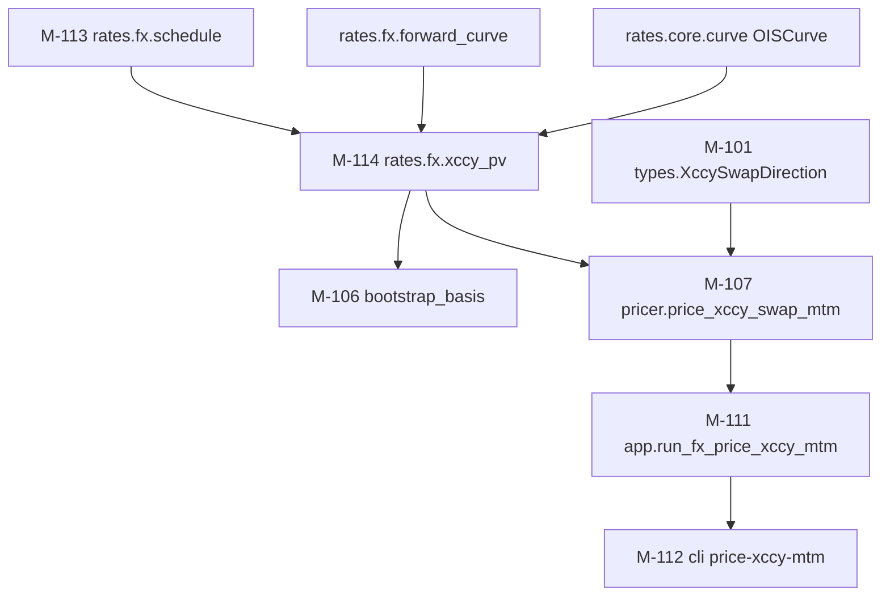

# V0.5 — MtM Cross-Currency Basis Swap Pricer — Architecture

**Based on:** `docs/v05-xccy-mtm-pricer-requirements.md` (MON-022, validated +
grill-passed 2026-05-29 — F-601..F-604, D-601..D-607, OQ-601..607 resolved),
`docs/v04-xccy-calibration-architecture.md` (MON-020, §5 strip mathematics,
A-4/A-8/OQ-501, C-108 frozen, C-110 OIS reconstruction),
`docs/fx-architecture.md` (V2 FX math layer).
**Date:** 2026-05-29
**Status:** Draft — grill-passed 2026-05-29 (Bulgu 3/4 + OQ-611..614 resolved → A-608/A-609, §5.3 sign fix); pending user validation
**Ticket:** MON-022

This document turns the validated V0.5 requirements into an implementable
design. It freezes the module boundaries (one **new** module, five **modified**),
the exact MtM PV mathematics and its relationship to the V0.4 strip, the two new
interface contracts, the no-schema-change confirmation, and a build order. **No
new modelling decisions are introduced** beyond what D-601..D-607 already locked;
the architecture-level choices appear as A-601..A-607 in §8.

> **Identifier scheme.** Continues MON-022's 6xx block: architecture decisions
> `A-6xx`, open architecture questions `OQ-6xx` (≥ 611, after the requirements'
> OQ-601..607). Modules continue the global sequence (`M-113` last in V0.4 →
> `M-114` new; modified modules keep their IDs). Contracts continue `C-110` last
> → `C-111`, `C-112`.

---

## 1. Architectural Drivers (delta from V0.4)

| # | Driver | Consequence for this design |
|---|--------|------------------------------|
| **DV-1** (correctness / consistency) | The MtM PV must stay arbitrage-consistent with the V0.4 strip, and the **marginal-vs-par-flat** subtlety (grill Bulgu 1) is easy to get wrong: a flat contract spread is **not** the marginal `b_n`. | The PV path **shares the strip's exact net-PV arithmetic** (M-114). Round-trip is anchored two ways (D-606): par-flat self-consistency + feeding the strip's bucketed `b_1..b_n` vector through the shared kernel. A dedicated negative test pins `PV(basis_at(T_n)) ≠ 0` for `n>1`. |
| **DV-2** (reuse / regression risk) | The strip (`bootstrap_basis`) is released, calibrated, and covered by `phase9` tests that **import its public exceptions** and assert `pytest.raises(XccyBootstrapError)` on the coverage path. Refactoring its PV core risks regressing the release. | The shared kernel (M-114) is **pure math only** — no diagnostics, no exceptions. The strip keeps `XccyBootstrapError` / `FXBootstrapNonConvergentError` and its `_check_forward_coverage` behaviour **unchanged** (so `phase9` stays green); only the per-coupon term build + net-PV move out, behind a behaviour-preserving refactor. |
| **DV-3** (coupling / layering) | The pricer must not import from `bootstrap_basis` and vice-versa (OQ-601), or the strip and pricer become entangled. | Both depend **only** on the new leaf module M-114 (`rates.fx.xccy_pv`). M-114 depends on M-113 (schedule) + `rates.core.curve` + `rates.fx.forward_curve`. No cycle. |
| **DV-4** (surface minimalism) | V0.5 is additive; the persisted FXSummary already carries everything the pricing path needs. | **No schema change** (`FX_SCHEMA_VERSION` stays 2). The existing reconstruction adapters (`_dom_ois_from_summary`, `_for_ois_from_summary`, `_fx_forward_from_summary`) are reused verbatim. **No new diagnostic codes** (A-605). |

**No new external dependencies. No `rates.core` edits.** Layering preserved
(`rates.fx` → `rates.core`, never reverse; IO/schema reconstruction in
`rates.app`).

---

## 2. Tech Stack

Identical to V0.4/v0.3.0 — V0.5 is a math + CLI change inside the existing stack.
No table changes; the load-bearing reuses:

| Concern | Choice | Rationale |
|---------|--------|-----------|
| PV arithmetic | Plain Python floats, same formulas as M-106 | D-604/D-606: one shared kernel, no new numeric library. |
| Par-flat spread | **Closed form** (no solver) | `s_par_flat = −pv_for0·S·1e4 / A_for` (foreign-quoted); the round-trip needs no brentq. The strip keeps brentq (D-13) — the MtM path is linear and closed-form, so a solver would be ceremony. |
| Direction | `StrEnum` in `rates.fx.types` | Type-safe, mirrors `QuoteConvention`; CLI maps the flag. |
| Tests | pytest, **new `phase10` marker** | Mirrors the `phase6..phase9` boundary discipline (registered in `pyproject.toml`). |

---

## 3. Module Decomposition

### 3.1 Module Overview

One **new** module (M-114); five **modified**. (M-110 persistence is **not**
touched — no schema change.)

| ID | Module | Change | Responsibility (V0.5) | Complexity | Agent | Features |
|----|--------|--------|------------------------|------------|-------|----------|
| **M-114** | `rates.fx.xccy_pv` | **new** | Pure shared xccy net-PV kernel: per-coupon `XccyCouponTerm`, `build_xccy_leg_terms` (schedule + terms + spread-free foreign base PV), `net_pv` (per-coupon spread **vector** → unit-notional net PV in domestic units, as of spot), `forward_covers` predicate. No diagnostics, no exceptions, no IO. | **high** | **opus** | F-601, F-602 |
| **M-106** | `rates.fx.bootstrap_basis` | **refactor body (behaviour-preserving)** | Strip now builds per-coupon terms via M-114 and solves each pillar via `net_pv` with a strip-built **bucketed** spread vector. Public signature, exceptions, diagnostics, and numeric results **unchanged** (`phase9` green). | medium | **opus** | F-602 |
| **M-107** | `rates.fx.pricer` | **add `price_xccy_swap_mtm`** | New MtM pricer (C-111): apply a flat contract spread across the M-114 schedule, return PV in domestic units (as of spot), signed by direction, scaled by notional. Emits `FX_XCCY_FORWARD_COVERAGE` on a short forward curve. `price_xccy_basis_swap` (C-108) **untouched**. | **high** | **opus** | F-601 |
| **M-101** | `rates.fx.types` | **extend (tiny)** | Add `XccySwapDirection` StrEnum (`receive-domestic` / `pay-domestic`). No new diagnostic-code constants. | low | haiku | F-601 |
| **M-111** | `rates.app` | **add `run_fx_price_xccy_mtm`** | New pricing verb body: resolve maturity (`--tenor` ⊕ `--maturity`), validate vs spot/calendar, reconstruct dom/for OIS + FX forward (existing C-110 adapters + schema-version guard), call the pricer, print PV. | medium | sonnet | F-603 |
| **M-112** | `rates.cli` | **add `price-xccy-mtm` parser** | New `rates fx price-xccy-mtm` subparser: shared FX args + `--spread` + `--notional` + `--direction` + (`--tenor` ⊕ `--maturity`) mutex. <30 LoC delegate. | low | sonnet | F-603 |
| — | `pyproject.toml` | **extend (markers)** | Register `phase10`. | low | haiku | F-604 |

**Feature → module trace:**

| Feature | Modules |
|---------|---------|
| F-601 MtM PV pricer | M-107 (consumes M-114, M-101) |
| F-602 Shared net-PV kernel | M-114 (+ M-106 refactor consuming it) |
| F-603 CLI verb | M-111, M-112 |
| F-604 Round-trip + independent-anchor tests | `phase10` tests across M-114/M-107 (+ `pyproject.toml`) |

### 3.2 Module Details

```json
{
  "modules": [
    {
      "module_id": "M-114",
      "name": "rates.fx.xccy_pv",
      "responsibility": "Pure shared xccy net-PV kernel consumed by both the strip (M-106) and the MtM pricer (M-107): build per-coupon discount/forward terms + the spread-free foreign base PV, and evaluate the net PV for an arbitrary per-coupon spread vector. Unit-notional (N_dom=1), domestic units, as of the spot date.",
      "owns_data": ["XccyCouponTerm (tau, df_dom, fwd)", "the net-PV formula (§5.2)"],
      "depends_on": ["M-113 (rates.fx.schedule)", "rates.core.curve (OISCurve.df_at)", "rates.fx.forward_curve (FXForwardCurve.forward_at)"],
      "external_deps": [],
      "features_served": ["F-601", "F-602"],
      "complexity": "high",
      "suggested_agent": "opus",
      "new_file": "src/rates/fx/xccy_pv.py",
      "implementation_note": "Lift _CouponTerm (minus the strip-specific `bucket` field) and the _coupon_terms / _net_pv arithmetic out of bootstrap_basis VERBATIM (no formula change). Move the shared constants STRIP_DAY_COUNT=Act/360, STRIP_BDC=MODIFIED_FOLLOWING, BPS_PER_UNIT=1e4 here; bootstrap_basis imports them back. net_pv takes spread_bps_per_coupon: Sequence[float] (len == len(terms)) — this is the ONLY shape change vs the bucketed _net_pv. PURE: no DiagnosticsCollector, no raises beyond what forward_at/df_at already raise. build_xccy_leg_terms returns (XccySchedule, list[XccyCouponTerm], pv_for0) so the strip can derive its buckets from schedule.coupon_dates."
    },
    {
      "module_id": "M-106",
      "name": "rates.fx.bootstrap_basis (refactor)",
      "responsibility": "Strip a CrossCurrencyBasisCurve via sequential par->pillar net-PV=0 calibration (unchanged behaviour), now delegating the per-coupon term build and net-PV evaluation to M-114.",
      "owns_data": ["CrossCurrencyBasisCurve", "the sequential bucket->pillar solve", "XccyBootstrapError / FXBootstrapNonConvergentError / MixedQuotedLegError", "_check_forward_coverage (UNCHANGED)"],
      "depends_on": ["M-114", "M-104 (basis_curve)", "M-113 (schedule)", "rates.core.curve"],
      "external_deps": ["scipy.optimize.brentq"],
      "features_served": ["F-602"],
      "complexity": "medium",
      "suggested_agent": "opus",
      "modified_file": "src/rates/fx/bootstrap_basis.py",
      "implementation_note": "Replace local _CouponTerm/_coupon_terms/_net_pv with calls to M-114. Per pillar: (schedule, terms, pv_for0) = xccy_pv.build_xccy_leg_terms(...); buckets = [bisect_left(grid_maturities, c)+1 for c in schedule.coupon_dates]; in the brentq objective build spread_vec[i] = trial_bps if buckets[i]==n else solved_bps[buckets[i]-1], then net_pv(terms, pv_for0, spot_rate, quoted_on_foreign=..., spread_bps_per_coupon=spread_vec). Keep _check_forward_coverage and the XccyBootstrapError it raises EXACTLY (phase9 test_strip.py:270/281 pin it). Keep the reprice assert (|NPV|<1e-9 -> FX_XCCY_REPRICE_FAIL). Net numeric result must be bit-for-bit equivalent — phase9 is the gate."
    },
    {
      "module_id": "M-107",
      "name": "rates.fx.pricer (price_xccy_swap_mtm)",
      "responsibility": "Mark-to-market PV of a spot-starting, constant-notional, float-float xccy basis swap at a flat contract spread, in domestic units, as of the spot date.",
      "owns_data": [],
      "depends_on": ["M-114", "M-101 (XccySwapDirection)", "rates.core.curve", "rates.fx.forward_curve", "rates.core.diagnostics", "rates.core.calendar"],
      "external_deps": [],
      "features_served": ["F-601"],
      "complexity": "high",
      "suggested_agent": "opus",
      "modified_file": "src/rates/fx/pricer.py",
      "implementation_note": "Does NOT import bootstrap_basis (DV-3) and does NOT consume CrossCurrencyBasisCurve. Steps: spot=fx_forward.spot_date, S=fx_forward.spot_rate; if not xccy_pv.forward_covers(maturity_date, fx_forward): dg.error(FX_XCCY_FORWARD_COVERAGE, ...); raise ValueError. (schedule, terms, pv_for0) = build_xccy_leg_terms(...); spread_vec = [contract_spread_bps]*len(terms); npv_unit = net_pv(terms, pv_for0, S, quoted_on_foreign=..., spread_bps_per_coupon=spread_vec); sign = +1 if direction is RECEIVE_DOMESTIC else -1; return sign * notional_domestic * npv_unit. maturity<=spot is rejected upstream (M-111) so build_quarterly_xccy_schedule's ValueError is a defensive backstop. price_xccy_basis_swap stays byte-identical."
    },
    {
      "module_id": "M-101",
      "name": "rates.fx.types (XccySwapDirection)",
      "responsibility": "Add the MtM direction enum.",
      "owns_data": ["XccySwapDirection"],
      "depends_on": [],
      "external_deps": [],
      "features_served": ["F-601"],
      "complexity": "low",
      "suggested_agent": "haiku",
      "modified_file": "src/rates/fx/types.py",
      "implementation_note": "class XccySwapDirection(StrEnum): RECEIVE_DOMESTIC='receive-domestic'; PAY_DOMESTIC='pay-domestic'. Add to __all__. No new FX_* diagnostic-code constants (A-605)."
    },
    {
      "module_id": "M-111",
      "name": "rates.app (run_fx_price_xccy_mtm)",
      "responsibility": "Orchestrate the MtM pricing verb: load context, resolve maturity, validate, reconstruct curves, price, print.",
      "owns_data": ["run_fx_price_xccy_mtm"],
      "depends_on": ["M-107", "M-114 (none directly — via pricer)", "rates.fx.types", "existing C-110 adapters"],
      "external_deps": [],
      "features_served": ["F-603"],
      "complexity": "medium",
      "suggested_agent": "sonnet",
      "modified_file": "src/rates/app.py",
      "implementation_note": "Model on run_fx_price_xccy. Use _load_fx_pricing_context (require_basis only when --tenor is used; --maturity needs no basis). Maturity resolution: --tenor -> basis pillar maturity (reuse the run_fx_price_xccy lookup, FX_PRICE_UNKNOWN_TENOR); --maturity -> the date directly. Mutex via _resolve_tenor_or_value_date-style guard (reuse FX_PRICE_TENOR_VALUE_DATE_MUTEX). Validate maturity > spot (FX_PRICE_VALUE_DATE_BEFORE_SPOT) and joint-business-day (FX_PRICE_INVALID_VALUE_DATE) with a TRIMMED check — do NOT reuse _validate_pricing_value_date's past-last-pillar branch (its FX_PRICE_EXTRAPOLATION WARN would double-report with the pricer's FX_XCCY_FORWARD_COVERAGE ERROR; OQ-612/A-608: the strip's ERROR is authoritative for xccy). Schema-version guard + _dom/_for_ois_from_summary + _fx_forward_from_summary (existing). require_basis=True always (A-609) so quoted_on_foreign = summary.basis_pillars[0].quoted_on_foreign. Catch ValueError from the pricer and fall through to _print_exit (the FX_XCCY_FORWARD_COVERAGE ERROR is already on dg)."
    },
    {
      "module_id": "M-112",
      "name": "rates.cli (price-xccy-mtm parser)",
      "responsibility": "Register the new subcommand and delegate to run_fx_price_xccy_mtm.",
      "owns_data": [],
      "depends_on": ["M-111"],
      "external_deps": [],
      "features_served": ["F-603"],
      "complexity": "low",
      "suggested_agent": "sonnet",
      "modified_file": "src/rates/cli.py",
      "implementation_note": "_add_fx_price_xccy_mtm_parser: _add_fx_shared(persistence=True); --spread (type=float, required); --notional (type=float, required); --direction (choices=['receive-domestic','pay-domestic'], default='receive-domestic'); mutually-exclusive (required) group --tenor (dest=tenor_code) / --maturity (dest=maturity_date, type=date.fromisoformat). Body _fx_price_xccy_mtm_command -> run_fx_price_xccy_mtm."
    }
  ]
}
```

---

## 4. Interface Contracts

Two new contracts. **C-108 (`price_xccy_basis_swap`) and C-104′
(`build_cross_basis_curve`) signatures are UNCHANGED** — the strip's public
surface and the fair-basis interpolator are untouched; only `bootstrap_basis`'s
private internals move behind C-112.

```json
{
  "contracts": [
    {
      "contract_id": "C-112",
      "from": "M-106 (bootstrap_basis), M-107 (pricer)",
      "to": "M-114 (rates.fx.xccy_pv)",
      "type": "function_call",
      "interface": {
        "types": {
          "XccyCouponTerm": "frozen dataclass { tau: float, df_dom: float, fwd: float }  (NO bucket — strip-specific)"
        },
        "functions": [
          {
            "name": "build_xccy_leg_terms",
            "input": "(spot_date: date, maturity: date, dom_ois: OISCurve, for_ois: OISCurve, fx_forward: FXForwardCurve, spot_rate: float, dom_calendar: HolidayCalendar, for_calendar: HolidayCalendar)",
            "output": "tuple[XccySchedule, list[XccyCouponTerm], float]  -> (schedule, terms, pv_for0)",
            "semantics": "Builds the quarterly schedule (M-113, Act/360 + modified-following), df_dom re-anchored at spot (DF_dom(t_i)/DF_dom(spot)), fwd = fx_forward.forward_at(t_i), foreign OIS forward f_for,i; pv_for0 = (1/S)*(-S + Sum F_i*f_for,i*tau_i*DF_dom_i + F_N*DF_dom_N). Pure; raises only ValueError propagated from forward_at/df_at if a date is out of range (callers pre-check coverage).",
            "error_cases": ["ValueError: maturity <= spot_date (from build_quarterly_xccy_schedule)", "ValueError: a coupon date is beyond fx_forward/OIS coverage (propagated)"]
          },
          {
            "name": "net_pv",
            "input": "(terms: list[XccyCouponTerm], pv_for0: float, spot_rate: float, *, quoted_on_foreign: bool, spread_bps_per_coupon: Sequence[float])",
            "output": "float  (unit-notional N_dom=1 net PV, domestic units, as of spot)",
            "semantics": "spread_sum = Sum_i (b_i/1e4)*(fwd_i if quoted_on_foreign else 1)*tau_i*DF_dom_i; return -(pv_for0 + spread_sum/S) if quoted_on_foreign else (spread_sum - pv_for0). Identical arithmetic to the V0.4 _net_pv, generalised from buckets to an explicit per-coupon vector.",
            "error_cases": ["ValueError: len(spread_bps_per_coupon) != len(terms) (zip strict=True)"]
          },
          {
            "name": "forward_covers",
            "input": "(longest_coupon: date, fx_forward: FXForwardCurve)",
            "output": "bool  (longest_coupon <= fx_forward.pillars_tuple[-1].settle_date)",
            "semantics": "Pure predicate; no diagnostics. Callers emit FX_XCCY_FORWARD_COVERAGE themselves.",
            "error_cases": []
          }
        ],
        "constants_moved_here": ["STRIP_DAY_COUNT = DayCount.ACT_360", "STRIP_BDC = BusinessDayConvention.MODIFIED_FOLLOWING", "BPS_PER_UNIT = 10000.0"],
        "note": "M-114 is a pure leaf: no DiagnosticsCollector, no FX_* emission, no module-local exception types. This is what keeps the strip's exception contract (XccyBootstrapError, in bootstrap_basis) and the pricer (raises plain ValueError) decoupled (DV-2, DV-3)."
      }
    },
    {
      "contract_id": "C-111",
      "from": "rates.app (M-111), rates.cli (M-112)",
      "to": "M-107 (price_xccy_swap_mtm)",
      "type": "function_call",
      "interface": {
        "name": "price_xccy_swap_mtm",
        "input": "(dom_ois: OISCurve, for_ois: OISCurve, fx_forward: FXForwardCurve, *, maturity_date: date, contract_spread_bps: float, notional_domestic: float, quoted_on_foreign: bool, direction: XccySwapDirection, dom_calendar: HolidayCalendar, for_calendar: HolidayCalendar, diagnostics: DiagnosticsCollector)",
        "output": "float  (PV in domestic units, as of the spot date; PV = sign(direction) * notional_domestic * net_pv_unit; sign = +1 RECEIVE_DOMESTIC, -1 PAY_DOMESTIC)",
        "error_cases": [
          "FX_XCCY_FORWARD_COVERAGE (ERROR on dg) + raise ValueError: maturity_date beyond the FX forward curve's last pillar (no silent extrapolation, reuses OQ-505 rule)",
          "ValueError: maturity_date <= spot_date (defensive; M-111 rejects upstream)",
          "ValueError: notional_domestic < 0 (use direction for the side, not a negative notional — D-605/OQ-605)"
        ],
        "diagnostic_codes_emitted": ["FX_XCCY_FORWARD_COVERAGE (reused; no new codes — A-605)"],
        "rationale": "Separate from C-108 (D-602): fair-basis interpolation and PV are different operations. Adds fx_forward (C-108 lacks it) + the contract terms. PV = sign(direction)*N_dom*net_pv; canonical RECEIVE_DOMESTIC/foreign-quoted closed form N_for*(s_par_flat - contract_spread)*A_for/1e4, N_for = N_dom/S — net_pv is authoritative for the sign (Bulgu 3)."
      }
    }
  ]
}
```

### Contract notes
- **No untyped dicts cross seams.** `XccyCouponTerm` and `XccySchedule` are frozen
  dataclasses; `XccySwapDirection` is a `StrEnum`.
- **Exit-code policy unchanged** (0 = WARN-only, 2 = any ERROR).
- **The public MtM signature takes a SCALAR `contract_spread_bps`** (a real swap
  carries one flat spread). The per-coupon **vector** lives only inside C-112;
  the round-trip "bucketed cross-check" (F-604b) calls `net_pv` directly with
  the strip's `b_1..b_n`, not the public pricer.

---

## 5. The MtM PV Mathematics (precise)

This is the load-bearing spec for M-114/M-107. It is the V0.4 strip's PV machine
(`docs/v04-xccy-calibration-architecture.md` §5.1–§5.2) **re-used**, with the
spread held to the contract value and the result returned as a PV rather than
solved to zero.

### 5.1 Instrument (D-601)

Constant-notional, float-float xccy basis swap, **starting at the curve spot
date** `t_0 = spot`, maturing at `maturity`. Quarterly schedule (M-113, Act/360
both legs, modified-following, joint calendar; D-605). Notional exchange at `t_0`
(rate `S = fx_forward.spot_rate`) and `t_N = maturity`. `N_dom` is the domestic
notional; `N_for = N_dom / S`. The flat contract spread `b` (bps) sits on the
foreign leg when `quoted_on_foreign` else the domestic leg.

### 5.2 PV in domestic units, as of spot (D-607)

Domestic discounting is anchored at spot (`DF_dom(spot) = 1`, via
`dom_ois.df_at(t_i)/dom_ois.df_at(spot)`), so the returned PV is **as of the
spot date**. With the V0.4 base (spread-free) foreign PV in domestic units
`PV_for0` (computed by `build_xccy_leg_terms`), the unit-`N_dom` net PV at a
per-coupon spread vector `{b_i}` is (foreign-quoted):

```
net_pv = − ( PV_for0  +  (1/S) · Σ_i (b_i/1e4) · F_i · τ_i · DF_dom_i )
```

(domestic-quoted: `net_pv = Σ_i (b_i/1e4)·τ_i·DF_dom_i − PV_for0`). This is the
identical formula to the V0.4 `_net_pv`; the only generalisation is that `{b_i}`
is an explicit vector (the strip fills it from buckets; the MtM pricer fills it
constant `b_i ≡ contract_spread`).

**Reported PV:** `PV = sign(direction) · N_dom · net_pv`.

### 5.3 Par-flat spread & the round-trip (D-606, grill Bulgu 1)

For a **flat** spread `b` the net PV is linear in `b` (foreign-quoted):

```
net_pv(b) = − ( PV_for0 + (b/1e4) · A_for / S ),   A_for = Σ_i F_i·τ_i·DF_dom_i
```

so the **par flat spread** that zeroes it is closed-form:

```
s_par_flat = − PV_for0 · S · 1e4 / A_for      (bps)
```

and the reported PV (RECEIVE_DOMESTIC base, foreign-quoted) is

```
PV = sign(direction) · N_dom · net_pv
   = N_for · (s_par_flat − b) · A_for / 1e4        (RECEIVE_DOMESTIC, foreign-quoted)
```

**`net_pv` is the authoritative source for the exact sign** under each
(`quoted_on_foreign`, `direction`) pair (grill Bulgu 3 — do not hand-transcribe a
sign; derive it from `net_pv`). The implementation calls `net_pv` directly; the
closed form above is only for the par-flat test (where the value is 0, so sign is
moot) and for intuition. Round-trip anchors:

1. **Par-flat self-consistency (F-604a):** `price_xccy_swap_mtm(b = s_par_flat)`
   → `|PV| < 1e-9 · max(1, |N_dom|)`. Holds at **any** priceable maturity
   (compute the unit-notional `net_pv` internally, assert `< 1e-9`, then scale).
2. **Bucketed cross-check vs. the strip (F-604b):** at a calibrated pillar `T_n`,
   `net_pv(terms, pv_for0, S, quoted_on_foreign, spread=[b_1..b_n bucketed])` →
   `0` to `< 1e-9` (reproduces the strip's net-PV=0). This validates M-114
   against M-106.
3. **Negative guard (F-604g):** `s_par_flat = b_n` (marginal) **only at `T_1` or a
   flat curve**; for `n>1` on a non-flat curve, `PV(basis_at(T_n)) ≠ 0` — assert
   non-zero, never zero.

### 5.4 Independent anchor (F-604c, mirrors strip grill G-2)

A 1–2-period hand-computed micro-case: pick simple forwards/DFs, work out
`net_pv` and `s_par_flat` on paper (currency-native arithmetic), assert the
pricer matches within a documented tolerance. The repo already has the pattern:
`tests/fx/test_strip.py::_independent_net_pv` is an **independent** reimplementation
— the `phase10` tests reuse that style (NOT the production kernel) for the
expected value.

---

## 6. No Schema Change (confirmation)

`FX_SCHEMA_VERSION` stays **2**. The pricing path needs `dom_ois`, `for_ois`,
`fx_forward` — all already persisted in FXSummary v2 and reconstructable by the
**existing** adapters in `rates.app`:

| Need | Source (already present) |
|------|--------------------------|
| `dom_ois` | `_dom_ois_from_summary(summary)` (C-110) |
| `for_ois` | `_for_ois_from_summary(summary)` (C-110) |
| `fx_forward` | `_fx_forward_from_summary(summary)` |
| `--tenor` → maturity | `summary.basis_pillars` lookup (as in `run_fx_price_xccy`) |
| `quoted_on_foreign` | `summary.basis_pillars[0].quoted_on_foreign` (when basis present) |
| schema guard | `summary.schema_version != FX_SCHEMA_VERSION` → `FX_PRICE_SCHEMA_TOO_OLD` |

`rates.io.schemas`, `rates.io.persistence` (M-109/M-110) are **untouched**.

---

## 7. Data Flow & Sequences

### 7.1 Module dependency (new + touched)



### 7.2 `rates fx price-xccy-mtm` sequence

```mermaid
sequenceDiagram
    participant U as User
    participant CLI as M-112 cli
    participant APP as M-111 run_fx_price_xccy_mtm
    participant SUM as FXSummary v2 (disk)
    participant ADP as C-110 adapters
    participant PRC as M-107 price_xccy_swap_mtm
    participant KER as M-114 xccy_pv

    U->>CLI: rates fx price-xccy-mtm --pair USDTRY --tenor 1Y --spread -150 --notional 1e7
    CLI->>APP: run_fx_price_xccy_mtm(args)
    APP->>SUM: load latest usdtry_fx_summary.json
    APP->>APP: schema_version==2? else FX_PRICE_SCHEMA_TOO_OLD
    APP->>APP: resolve --tenor->maturity (basis pillars); validate > spot, business day
    APP->>ADP: _dom_ois / _for_ois / _fx_forward _from_summary
    APP->>PRC: price_xccy_swap_mtm(dom,for,fwd, maturity, spread, N, qof, dir, cals, dg)
    PRC->>KER: forward_covers? build_xccy_leg_terms; net_pv([spread]*K)
    KER-->>PRC: net_pv_unit
    PRC-->>APP: PV = sign*N*net_pv_unit
    APP-->>U: "mtm_xccy(USDTRY 1Y, spread=-150.00 bps, N=10,000,000) PV = <...> TRY"  + exit 0
```

---

## 8. Decisions & Trade-offs

| # | Decision | Chosen | Rejected | Rationale / Trace |
|---|----------|--------|----------|-------------------|
| A-601 | Shared-kernel location (OQ-601) | **New leaf module `rates.fx.xccy_pv` (M-114), pure math, vector spread** | Keep helpers in `bootstrap_basis` and import into pricer; or a method on a curve | DV-3 (no pricer↔bootstrap coupling); DV-2 (pure leaf keeps the strip's exception contract intact). Vector spread forced by D-606. |
| A-602 | Strip refactor style | **Behaviour-preserving: move term-build + net-PV to M-114, keep buckets/exceptions/coverage in M-106** | Rewrite the strip around the kernel | `phase9` (incl. `pytest.raises(XccyBootstrapError)` on coverage, `_independent_net_pv` anchor) is the regression gate; minimise churn on a released module. |
| A-603 | Par-flat spread | **Closed form `s_par_flat = −PV_for0·S·1e4/A_for`** | brentq solve | The MtM path is linear; a solver is ceremony. (The strip keeps brentq per D-13 for its own reasons.) |
| A-604 | Coverage check ownership | **Pricer calls `forward_covers` (pure, M-114) and emits `FX_XCCY_FORWARD_COVERAGE` itself; strip keeps its own `_check_forward_coverage`** | Share one coverage function that raises | Strip's coverage raises `XccyBootstrapError` (pinned by `phase9`); sharing the *raising* form would entangle exception types. Sharing only the pure predicate is safe. |
| A-605 | New diagnostic codes | **None** | Add `FX_PRICE_MTM_*` codes | All needed codes exist: `FX_XCCY_FORWARD_COVERAGE`, `FX_PRICE_SCHEMA_TOO_OLD`, `FX_PRICE_UNKNOWN_TENOR`, `FX_PRICE_VALUE_DATE_BEFORE_SPOT`, `FX_PRICE_INVALID_VALUE_DATE`, `FX_PRICE_TENOR_VALUE_DATE_MUTEX`. Reuse; keep the surface tight. |
| A-606 | Direction representation (OQ-602) | **`XccySwapDirection` StrEnum, base = strip `_net_pv` sign (RECEIVE_DOMESTIC), ×±1** | Signed notional; bare bool | Type-safe, self-documenting in the CLI; negative notional rejected (D-605/OQ-605). |
| A-607 | CLI maturity input (OQ-607) | **`--tenor` ⊕ `--maturity` mutually-exclusive (required)** | `--tenor` only | Off-pillar MtM is the interesting case; mirrors the outright/swap verbs' tenor/value-date mutex. `--tenor` resolves via basis pillars; both paths require a basis-bearing summary (A-609). |
| A-608 | OIS-curve coverage (grill Bulgu 4) | **Guard only the FX forward curve (`forward_covers`); accept the strip's latent OIS-coverage behaviour + add a defensive `phase10` test** | Add a separate dom/for OIS coverage guard + new diagnostic | Consistent with the released strip (which also guards only the FX forward); OIS curves extend years, so the FX forward is the binding constraint. A `--maturity` beyond OIS coverage raises a plain `ValueError` from `df_at` → the app catches it and exits 2 (no crash). A guard/code would be scope creep. |
| A-609 | `quoted_on_foreign` source (OQ-611) | **mtm verb always `require_basis=True`** (read `basis_pillars[0].quoted_on_foreign`); `--maturity` still needs a basis-bearing summary | Add a `--quoted-on-foreign` flag for basis-free pricing | Keeps the CLI consistent with `run_fx_price_xccy`; avoids a flag whose only job is to restate market convention. Basis-free MtM deferred. |

---

## 9. Open Architecture Questions — RESOLVED (grill-me, 2026-05-29)

The architecture grill produced two substantive findings — **Bulgu 3** (closed-form
PV **sign**: `net_pv` is authoritative; §5.3 corrected) and **Bulgu 4** (coverage
guards only the FX forward; A-608) — plus the resolutions below (now locked as
A-608/A-609 and §10 test notes).

| ID | Question | Resolution |
|----|----------|------------|
| **OQ-611** | **`quoted_on_foreign` source with `--maturity` and no basis pillars.** With `--tenor`, the pillar carries `quoted_on_foreign`. With `--maturity` and a snapshot that *has* basis pillars, read `basis_pillars[0].quoted_on_foreign`. But a snapshot with **no** basis pillars has no `quoted_on_foreign` to read — should `--maturity` then require an explicit `--quoted-on-foreign` flag, default to `True` (USD-leg street convention), or be rejected? | Require the persisted basis (so `quoted_on_foreign` is always available) for V0.5 — i.e. `--maturity` still needs a basis-bearing summary; reject otherwise with `FX_PRICE_BASIS_MISSING`. Defer a basis-free `--quoted-on-foreign` flag. (Keeps the CLI consistent with `run_fx_price_xccy`'s `require_basis=True`.) |
| **OQ-612** | **Maturity beyond the FX forward curve but a valid date.** `_validate_pricing_value_date` WARNs+clips past the last forward pillar for outright/swap; the xccy strip ERRORs (no extrapolation). Which wins for MtM? | The strip's rule (ERROR, `FX_XCCY_FORWARD_COVERAGE`) wins — an xccy swap needs the *whole* forward strip to maturity, not just one point; clipping would silently mis-price every coupon past the last pillar. So skip the outright-style WARN-clip for this verb. |
| **OQ-613** | **PV output formatting / precision.** What does stdout print — raw float, thousands-separated, with the domestic ISO code? Any rounding? | `mtm_xccy(<pair> <tenor|maturity>, spread=<b:+.2f> bps, N=<N:,.0f>) PV = <pv:,.2f> <DOM>`. Full-precision PV is also acceptable; pick `.2f` for money. Internal PV is unrounded; only the print rounds. |
| **OQ-614** | **`maturity == a coupon roll vs == spot+epsilon` / sub-quarter swaps.** `build_quarterly_xccy_schedule` already handles a single back-stub for sub-quarter maturities — is anything MtM-specific needed? | No — reuse M-113 as-is; add a `phase10` test for a sub-quarter `--maturity` to confirm the single-stub PV is finite and `s_par_flat` round-trips. |

---

## 10. Build Order

GitFlow per CLAUDE.md, on `feature/MON-022-mtm-xccy-pricer` (off `origin/develop`).
New `phase10` marker throughout. Likely 2–3 commits; **one PR to `develop` at the
end, no merge without user approval.**

```json
{
  "build_phases": [
    {
      "phase": 1,
      "name": "Shared kernel + strip refactor (M-114, M-106)",
      "modules": ["M-114", "M-106"],
      "rationale": "Risk-early: the behaviour-preserving extraction is the only thing that can regress a released module. Land it behind the phase9 gate before any new feature code.",
      "deliverable": "rates.fx.xccy_pv created (pure); bootstrap_basis consumes it; ALL phase9 tests green and the strip still reprices to 1e-9; new phase10 unit tests for net_pv (vector) + build_xccy_leg_terms + forward_covers.",
      "estimated_effort": "medium",
      "suggested_agent": "opus"
    },
    {
      "phase": 2,
      "name": "MtM pricer + types + tests (M-107, M-101, markers)",
      "modules": ["M-107", "M-101", "pyproject.toml"],
      "rationale": "The core feature. Lands on the Phase-1 kernel. Round-trip (par-flat + bucketed) + independent hand anchor + EURTRY sign + coverage + negative guard.",
      "deliverable": "price_xccy_swap_mtm (C-111); XccySwapDirection; phase10 marker registered; F-604 a-g tests green; price_xccy_basis_swap byte-identical (no diff).",
      "estimated_effort": "medium",
      "suggested_agent": "opus"
    },
    {
      "phase": 3,
      "name": "CLI verb + app wiring (M-111, M-112)",
      "modules": ["M-111", "M-112"],
      "rationale": "User-facing surface; pure composition of existing adapters + the new pricer.",
      "deliverable": "rates fx price-xccy-mtm prices on reconstructed curves; schema-too-old + unknown-tenor + mutex guards; phase10 CLI/integration tests; mypy --strict + ruff clean; V1 OIS smoke + FX smoke exit 0 (both unchanged).",
      "estimated_effort": "medium",
      "suggested_agent": "sonnet"
    }
  ]
}
```

### Ordering principles applied
- **Dependencies first:** M-114 → M-106/M-107 → M-111/M-112.
- **Risk early:** the released-module refactor (M-106) is Phase 1, gated by
  `phase9`, before any new feature is written on top.
- **Stub-free:** both new contracts (C-111, C-112) are locked here.

---

## 11. Quality Gates (NFR)

- `mypy --strict src/rates` clean (M-114, M-107, M-101, M-111, M-112).
- `ruff check src tests scripts` clean.
- `pytest -q` green: existing baseline **including all `phase9` strip tests
  unchanged**, plus new `phase10` (round-trip par-flat + bucketed cross-check,
  independent hand anchor, notional linearity, EURTRY sign branch, coverage
  abort, marginal-≠-par-flat negative guard).
- `price_xccy_basis_swap` unchanged (C-108 frozen — diff-clean).
- `FX_SCHEMA_VERSION` still 2; `rates.io.schemas` / `persistence` untouched.
- V1 OIS smoke (`scripts/smoke_test.py`) exit 0; FX smoke
  (`scripts/fx_smoke_test.py`) exit 0 — both unchanged.

---

## 12. Status

**Draft — grill-passed 2026-05-29; pending user validation.** Grill resolved
Bulgu 3 (PV sign → `net_pv` authoritative, §5.3 corrected), Bulgu 4 (FX-forward-only
coverage → A-608), and OQ-611..614 (→ A-608/A-609 + §10 test notes). Next: user
validation, then quant-developer implementation per §10.
